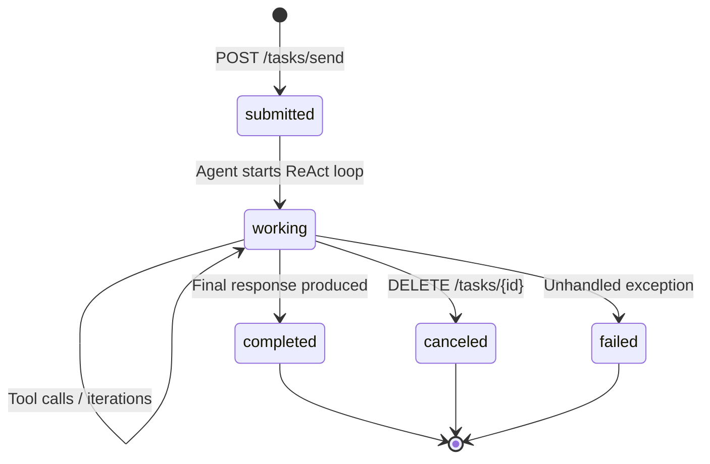

# A2A Protocol — Agent Discovery & Federation

Diva AI implements the [Agent-to-Agent (A2A) protocol](https://google.github.io/A2A/) to expose agents as interoperable endpoints consumable by external orchestrators — LangChain, AutoGen, Google ADK, or any A2A-compliant client — and to enable remote agent federation.

---

## What Is A2A?

A2A is an open protocol that defines how AI agents discover and communicate with each other over HTTP. It specifies:

- **AgentCard** — a JSON descriptor that tells external systems what an agent does, how to call it, and how to authenticate
- **Task lifecycle** — a standard request/response contract for submitting tasks, streaming progress, polling status, and cancelling

Diva implements both sides: agents are **discoverable** via `/.well-known/agent.json` and **callable** via `POST /tasks/send`.

---

## Discovery Endpoints

Agent discovery endpoints are **always public** — no authentication required. External systems need to discover an agent before they can authenticate, so requiring a token would create a chicken-and-egg problem.

| Endpoint | Returns | Auth required |
|----------|---------|---------------|
| `GET /.well-known/agent.json` | Single AgentCard (first published agent, per A2A spec) | None |
| `GET /.well-known/agent.json?agentId={id}` | AgentCard for a specific agent | None |
| `GET /.well-known/agents.json` | Array of all published agents, ordered by display name | None |
| `GET /.well-known/agents.json?tenantId={id}` | Published agents for a specific tenant (master admin) | None |

### Why Both Endpoints?

The A2A spec mandates `agent.json` (singular) as the standard single-agent discovery URL — external A2A clients always probe this path. The `agents.json` (plural) endpoint is a Diva extension that enables:

- Admin portal agent listings without an API key
- External orchestrators discovering all available agents in one request
- Multi-tenant deployments where each tenant has several published agents

### AgentCard Structure

```json
{
  "name": "Golf Analytics Agent",
  "description": "Analyses green fees, bookings, and revenue data for golf courses",
  "url": "https://diva.example.com/tasks/send?agentId=abc-123",
  "version": "1",
  "capabilities": {
    "streaming": true,
    "pushNotifications": false
  },
  "skills": [
    { "id": "analytics", "name": "analytics", "description": "Capability: analytics" },
    { "id": "revenue",   "name": "revenue",   "description": "Capability: revenue" }
  ],
  "authentication": {
    "schemes": ["Bearer"]
  },
  "defaultInputModes":  ["text"],
  "defaultOutputModes": ["text"]
}
```

Skills are derived from the agent's configured capabilities (or the archetype's default capabilities if none are set).

---

## Task Endpoints

Task execution endpoints **require authentication** — they run real agent ReAct loops, consume LLM tokens, and access tenant data.

| Endpoint | Description | Auth |
|----------|-------------|------|
| `POST /tasks/send?agentId={id}` | Submit a task, stream SSE progress | Bearer JWT or `X-API-Key` |
| `GET /tasks/{id}` | Poll task status | Bearer JWT or `X-API-Key` |
| `DELETE /tasks/{id}` | Cancel an in-flight task | Bearer JWT or `X-API-Key` |

### Streaming Task Progress

`POST /tasks/send` streams progress as Server-Sent Events in A2A format:

```
data: {"type":"TaskStatusUpdateEvent","id":"task-abc","status":{"state":"working","message":{"role":"agent","parts":[{"type":"text","text":"Analysing booking data..."}]}}}

data: {"type":"TaskArtifactUpdateEvent","id":"task-abc","artifact":{"parts":[{"type":"text","text":"Revenue for March: $42,500..."}]}}

data: {"type":"TaskStatusUpdateEvent","id":"task-abc","status":{"state":"completed"}}
```

### Rate Limiting

A2A task endpoints are rate-limited (`[EnableRateLimiting("a2a")]`) using a fixed-window policy. Defaults:

| Setting | Default | Config key |
|---------|---------|-----------|
| Max concurrent tasks | 10 | `A2A:MaxConcurrentTasks` |
| Rate limit per minute | 10 | `A2A:RateLimitPerMinute` |

Exceeding the limit returns HTTP 429.

---

## Auth Pipeline & Public Endpoint Bypass

Diva's `TenantContextMiddleware` runs before ASP.NET Core's built-in authentication middleware and validates every JWT/API key. Discovery endpoints must bypass this check — otherwise they would return 401 before the controller is even reached, and ASP.NET Core's `[AllowAnonymous]` attribute (which only suppresses the built-in auth middleware) would have no effect.

### Bypassed Paths

```
/swagger   — Swagger UI + OpenAPI spec
/hubs      — SignalR hub negotiation
/.well-known — A2A agent discovery (agent.json, agents.json)
/health    — Health check probes
```

`AgentCardController` also carries `[AllowAnonymous]` as defence-in-depth against ASP.NET Core's own auth middleware.

### Security Implications

Bypassing `TenantContextMiddleware` for `/.well-known` is safe because:

1. **No tenant data is exposed** — AgentCards contain only the agent's name, description, capabilities, and task URL. No business rules, prompts, sessions, or tool data.
2. **Task execution is still protected** — `POST /tasks/send` requires a valid JWT or API key; discovery never grants execution rights.
3. **Published agents only** — only agents with `Status == "Published" && IsEnabled == true` appear in discovery responses.

---

## Configuration

Enable A2A in `appsettings.json`:

```json
{
  "A2A": {
    "Enabled": true,
    "BaseUrl": "https://diva.example.com",
    "MaxConcurrentTasks": 10,
    "TaskRetentionDays": 7,
    "RateLimitPerMinute": 10,
    "MaxDelegationDepth": 3
  }
}
```

| Field | Default | Purpose |
|-------|---------|---------|
| `Enabled` | `true` | Master switch — `false` makes all A2A endpoints return 404 |
| `BaseUrl` | *(auto-detected from request)* | Override the base URL embedded in AgentCard `url` field |
| `MaxConcurrentTasks` | 10 | Concurrent task execution limit across all tenants |
| `TaskRetentionDays` | 7 | Completed/cancelled tasks are deleted after this many days |
| `RateLimitPerMinute` | 10 | Fixed-window rate limit for task submission |
| `MaxDelegationDepth` | 3 | Maximum recursive depth for agents-as-tools peer delegation |

---

## Task Lifecycle



Tasks are persisted to the `AgentTasks` table. The background `AgentTaskCleanupService` deletes tasks older than `TaskRetentionDays` daily.

---

## Integration with Peer Delegation

When a Diva agent has a **remote A2A endpoint** configured (`A2AEndpoint` field on the agent definition), the Supervisor's `DispatchStage` routes tasks to it via `A2AAgentClient` rather than running the agent locally. The `A2AAgentClient` uses `HttpClient` with a standard resilience handler (retry, circuit breaker, timeout).

For **local** peer delegation (agents calling other agents within the same Diva instance), see [Agents-as-Tools Delegation](agent-delegation.md) — this uses the direct `DelegationAgentResolver` path and does not go over HTTP.

---

## Key Files

| File | Purpose |
|------|---------|
| `src/Diva.Host/Controllers/AgentCardController.cs` | `GET /.well-known/agent.json` and `GET /.well-known/agents.json` |
| `src/Diva.Host/Controllers/AgentTaskController.cs` | `POST /tasks/send`, `GET /tasks/{id}`, `DELETE /tasks/{id}` |
| `src/Diva.Infrastructure/A2A/AgentCardBuilder.cs` | Builds AgentCard JSON from agent entity + archetype capabilities |
| `src/Diva.Infrastructure/A2A/IAgentCardBuilder.cs` | Interface — mockable in controller tests |
| `src/Diva.Infrastructure/A2A/A2AAgentClient.cs` | HTTP client for remote agent federation |
| `src/Diva.Infrastructure/A2A/AgentTaskCleanupService.cs` | Background service — deletes expired tasks |
| `src/Diva.Core/Configuration/A2AOptions.cs` | All A2A configuration options |
| `src/Diva.Infrastructure/Auth/TenantContextMiddleware.cs` | Auth middleware — includes `/.well-known` bypass |
