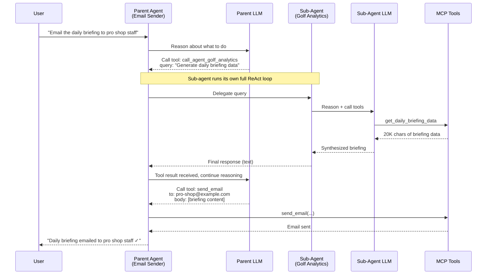
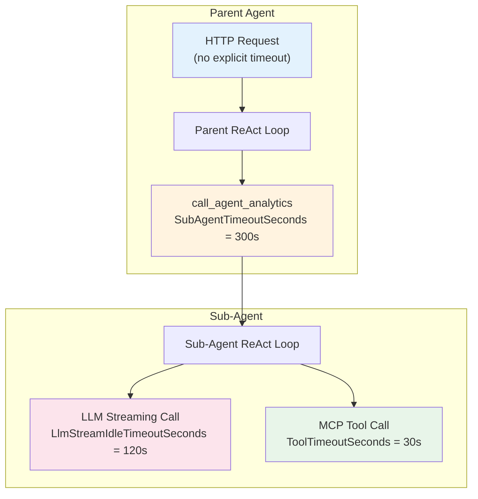
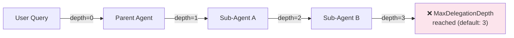

# Agents-as-Tools — Peer Delegation

Diva AI agents can delegate parts of their work to other agents. When a parent agent encounters a sub-task that falls outside its expertise, it can call another agent as if it were a tool — passing a query, receiving a response, and incorporating the result into its own reasoning.

This is distinct from the [Supervisor Pipeline](supervisor-pipeline.md), which decomposes and routes from the top down. Agents-as-tools delegation is **peer-to-peer** — any agent can call any other agent it has been configured to work with, and the delegation happens inline within the parent's ReAct loop.

---

## How It Works

When an agent is configured with delegate agents, those agents appear as synthetic tools in the parent's tool list — named `call_agent_{name}`. The LLM sees them alongside regular MCP tools and decides when to call them based on the query and available capabilities.



The key insight: the parent agent doesn't know or care how the sub-agent gets its data. It just calls a tool and gets a result. The sub-agent independently reasons, calls its own MCP tools, and produces a response.

---

## Execution Flow

### 1. Tool Discovery

When the parent agent starts, `AgentToolProvider` reads the agent's `DelegateAgentIdsJson` field and builds an `AgentDelegationTool` for each configured delegate. Each delegation tool is an `AIFunction` subclass with:

- **Name:** `call_agent_{agent_name}` (lowercase, spaces replaced with underscores)
- **Description:** The delegate agent's description + its capabilities
- **Parameters:** `query` (required) and `context` (optional)

These synthetic tools are merged with the agent's MCP tools, so the LLM sees a unified tool surface.

### 2. Tool Execution

When the LLM returns a `call_agent_*` tool call, the runner routes it to `AgentToolExecutor` instead of the MCP `ToolExecutor`. The executor:

1. **Checks delegation depth** against `A2AOptions.MaxDelegationDepth` (default 3) to prevent infinite recursion
2. **Builds an `AgentRequest`** with the query, optional context, and incremented depth counter
3. **Propagates tenant context** — the sub-agent inherits the parent's `TenantContext` including SSO token
4. **Executes with timeout** — uses `SubAgentTimeoutSeconds` (default 300 s), not the MCP `ToolTimeoutSeconds` (30 s)
5. **Returns the response** as a tool result, truncated to `MaxToolResultChars`

### 3. Sub-Agent Execution

The sub-agent runs its own **complete ReAct loop** — it's not a simple function call. The sub-agent:

- Loads its own agent definition (system prompt, tools, verification mode)
- Connects to its own MCP tool servers
- Runs multiple iterations with its own LLM calls
- Applies its own hooks and rule packs
- Produces a final response

This means a single parent tool call can trigger dozens of LLM calls and tool executions in the sub-agent.

---

## Timeout Architecture

Sub-agent delegation requires a multi-tier timeout architecture because the execution stack is deep:



### Timeout Tiers

| Tier | Config | Default | Applies To |
|------|--------|---------|------------|
| **Outer HTTP** | `LlmOptions.HttpTimeoutSeconds` | 600 s | HttpClient for all Anthropic/OpenAI calls |
| **Sub-agent delegation** | `AgentOptions.SubAgentTimeoutSeconds` | 300 s | Each `call_agent_*` tool call (full ReAct loop) |
| **LLM streaming idle** | `AgentOptions.LlmStreamIdleTimeoutSeconds` | 120 s | Idle gap between streamed chunks (resets per chunk) |
| **LLM buffered call** | `AgentOptions.LlmTimeoutSeconds` | 120 s | Absolute timeout for non-streaming LLM calls |
| **MCP tool call** | `AgentOptions.ToolTimeoutSeconds` | 30 s | Individual MCP tool execution |

All timeouts use `CancellationTokenSource.CreateLinkedTokenSource(ct)` — cancellation of any outer tier cascades to inner tiers. Set any timeout to `0` to disable it (falls back to the next outer tier).

### Why 300 Seconds for Sub-Agents?

A sub-agent with 10 iterations, each involving an LLM call (~5 s) and a tool call (~5 s), takes approximately 100 seconds. With large tool results that require extended LLM processing time (Claude can take 60+ seconds to process 20K+ characters), a complex sub-agent easily needs 3-5 minutes. The 300-second default provides headroom for these scenarios.

### Mid-Stream Retry

If an LLM streaming call fails mid-transfer (connection drop, idle timeout), the runner doesn't immediately propagate the error:

1. Partial streamed text is **discarded** (the buffered response will contain the complete text)
2. The call **falls back to buffered mode** (`CallLlmAsync`)
3. The buffered call automatically gets **3 retries** with exponential backoff via `CallWithRetryAsync`
4. Only if the buffered call also fails after all retries does the error propagate to the ReAct loop

This provides resilience against transient Anthropic connection drops without any configuration changes.

---

## Depth Control

To prevent infinite delegation loops (Agent A calls Agent B which calls Agent A), every delegation increments a depth counter in the request metadata:



When the depth limit is reached, the tool returns an error message: *"Agent delegation depth limit reached (3). Cannot delegate further."*

The depth counter is carried in `AgentRequest.Metadata["a2a_local_depth"]` and incremented at each hop.

---

## Auth & Tenant Context Flow

Delegation preserves the full security context:

```
Parent Request (TenantContext + AccessToken)
  └── AgentToolExecutor.ExecuteAsync(tenant, ct)
        └── DelegationAgentResolver.ExecuteAgentAsync(agentId, request, tenant)
              └── Sub-Agent ReAct Loop (same TenantContext)
                    └── MCP Tool Calls (tenant headers + SSO token forwarded)
```

- **TenantContext** flows through the entire delegation chain — the sub-agent sees the same tenant ID, site IDs, and user role as the parent
- **SSO token** is propagated when `ForwardSsoToMcp = true` on the parent request — the sub-agent's MCP tool calls include the original user's Bearer token
- **HttpContext** is available via `AsyncLocal` since delegation runs within the same HTTP pipeline — no separate HTTP request is made
- **EF query filters** continue to enforce tenant isolation in the sub-agent's database queries

---

## Configuration

### Admin Portal

In the Agent Builder, the **Delegate Agent Selector** component lets administrators choose which agents can be called by the current agent:

1. Open an agent in the Agent Builder
2. Navigate to the **Advanced** tab
3. In the **Agent Delegation** section, select one or more agents from the multi-select picker
4. Save — the selected agent IDs are stored in `DelegateAgentIdsJson`

Only enabled agents within the same tenant appear in the picker.

### appsettings.json

```json
{
  "Agent": {
    "ToolTimeoutSeconds": 30,
    "SubAgentTimeoutSeconds": 300,
    "LlmTimeoutSeconds": 120,
    "LlmStreamIdleTimeoutSeconds": 120
  },
  "A2A": {
    "MaxDelegationDepth": 3
  }
}
```

---

## Delegation vs. Supervisor Pipeline

Both mechanisms enable multi-agent collaboration, but they serve different purposes:

| Aspect | Agents-as-Tools Delegation | Supervisor Pipeline |
|--------|---------------------------|---------------------|
| **Trigger** | LLM decides to call a peer agent | Explicit multi-agent request decomposition |
| **Direction** | Peer-to-peer (any agent → any configured agent) | Top-down (supervisor → workers) |
| **Control** | LLM-driven — the parent decides when and what to delegate | Pipeline-driven — stages execute in order |
| **Timeout** | `SubAgentTimeoutSeconds` per delegation call | `SubAgentTimeoutSeconds` per worker in `DispatchStage` |
| **Depth** | Recursive (agent can delegate to agent that delegates to agent) | Single level (supervisor → workers, no nesting) |
| **Use case** | Agent needs another agent's expertise for part of its task | Complex query that spans multiple independent domains |
| **Session** | Sub-agent creates a child session linked via `ParentSessionId` | Workers share the supervisor's session context |

In practice, agents-as-tools delegation is more flexible and is the recommended approach for most multi-agent scenarios. The supervisor pipeline is better suited for structured decomposition of complex requests that always follow the same pattern.

---

## Key Files

| File | Purpose |
|------|---------|
| `src/Diva.Infrastructure/LiteLLM/AgentDelegationTool.cs` | `AIFunction` subclass — synthetic tool representing a peer agent |
| `src/Diva.Infrastructure/LiteLLM/AgentToolProvider.cs` | Builds `AgentDelegationTool` list from `DelegateAgentIdsJson` |
| `src/Diva.Infrastructure/LiteLLM/AgentToolExecutor.cs` | Executes `call_agent_*` with depth guard, timeout, SSO propagation |
| `src/Diva.Core/Configuration/IAgentDelegationResolver.cs` | Cross-project abstraction for agent lookup + execution |
| `src/Diva.Agents/Registry/DelegationAgentResolver.cs` | Bridges resolver → agent registry |
| `admin-portal/src/components/DelegateAgentSelector.tsx` | Multi-select agent picker in Agent Builder |
