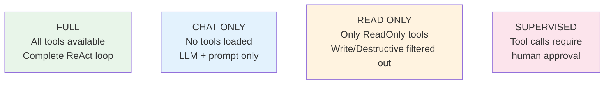
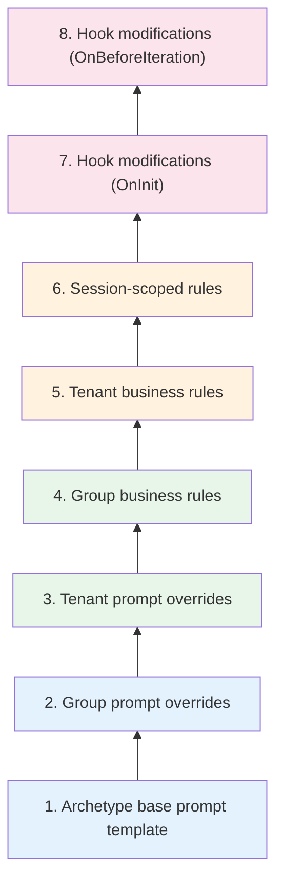

# Agent Archetypes

An **archetype** is a pre-built behavioral blueprint for an agent. Instead of configuring every setting from scratch, you select an archetype that matches your use case, and it pre-fills the agent with sensible defaults — system prompt, capabilities, hooks, tool preferences, execution mode, and more.

Archetypes are the starting point, not a constraint. Every default can be overridden at the agent level, the tenant level, or even per-request via lifecycle hooks.

---

## How Archetypes Work

When you create a new agent in the admin portal and select an archetype, three things happen:

1. **Creation-time defaults** — The archetype's settings pre-fill the agent configuration form (system prompt, temperature, tools, hooks, etc.). You can change any field before saving.

2. **Runtime merge** — When the agent executes, the runner merges archetype defaults with agent-level overrides. Agent settings always win:

    ```
    Effective value = agent.setting ?? archetype.default ?? global default
    ```

3. **Template variable resolution** — The archetype's system prompt template may contain `{{variable}}` placeholders. These are resolved using custom variables defined on the agent, allowing the same archetype to power very different agents.

This means updating an archetype's defaults affects all agents that haven't explicitly overridden those fields — a powerful way to evolve behavior fleet-wide.

---

## Built-In Archetypes

Diva ships with eight built-in archetypes covering the most common enterprise agent use cases:

### RAG (Retrieval-Augmented Generation)

For agents that answer questions by searching through document collections, knowledge bases, or vector stores. The RAG archetype emphasizes tool-grounded answers and includes built-in verification in LlmVerifier mode to catch hallucinated references.

**Default capabilities:** `search`, `knowledge-base`, `document-retrieval`
**Execution mode:** Full

### Data Analyst

For agents that query databases, generate metrics, create breakdowns, and produce data-driven insights. This archetype favors structured, number-heavy responses and is pre-configured to use analytics tools.

**Default capabilities:** `analytics`, `metrics`, `reporting`, `sql`
**Execution mode:** Full

### Code Analyst

For agents that read, analyze, review, and explain code. They work with code repository tools and are configured for precise, technical responses. Read-only by default to prevent unintended code modifications.

**Default capabilities:** `code-review`, `code-analysis`, `documentation`
**Execution mode:** ReadOnly

### Conversational

For general-purpose chatbots and assistants that handle natural-language conversations without tool access. These agents rely entirely on the LLM's knowledge and the system prompt.

**Default capabilities:** `chat`, `faq`, `support`
**Execution mode:** ChatOnly

### Researcher

For agents that gather information from multiple sources, synthesize findings, and produce comprehensive reports. They typically use web search, content fetching, and document tools.

**Default capabilities:** `research`, `web-search`, `summarization`
**Execution mode:** Full

### Coordinator

For agents that orchestrate other agents rather than performing work directly. The Coordinator archetype connects to the [Supervisor Pipeline](supervisor-pipeline.md) and routes sub-tasks to specialist workers.

**Default capabilities:** `coordination`, `task-routing`, `delegation`
**Execution mode:** Supervised

### Compliance Monitor

For agents that audit other agents' outputs against business rules, regulatory requirements, or internal policies. They typically run in Strict verification mode and flag non-compliant content.

**Default capabilities:** `compliance`, `audit`, `policy-check`
**Execution mode:** ReadOnly
**Verification mode:** Strict

### Remote A2A

For agents that act as proxies to external agents via the Agent-to-Agent (A2A) protocol. They delegate tasks to remote agent services and relay the results back.

**Default capabilities:** `remote-delegation`, `a2a`
**Execution mode:** Full

---

## Archetype Comparison

| Archetype | Tools | Verification | Execution Mode | Typical Use Case |
|-----------|-------|-------------|----------------|-----------------|
| RAG | Search / KB | LlmVerifier | Full | Knowledge Q&A |
| Data Analyst | Analytics / SQL | Auto | Full | Business metrics |
| Code Analyst | Code repos | ToolGrounded | ReadOnly | Code review |
| Conversational | None | Off | ChatOnly | Customer support |
| Researcher | Web / docs | Auto | Full | Research reports |
| Coordinator | (delegates) | Auto | Supervised | Multi-agent tasks |
| Compliance | Audit tools | Strict | ReadOnly | Policy enforcement |
| Remote A2A | A2A protocol | Auto | Full | Cross-platform delegation |

---

## Execution Modes

Every archetype sets a default execution mode that controls what the agent is allowed to do at runtime:



**Full** — The agent can use any tool and execute the complete ReAct loop. This is the default for most archetypes.

**ChatOnly** — All tools are removed before the LLM sees them. The agent can only reason from its system prompt and conversation history. Ideal for FAQ bots and conversational assistants.

**ReadOnly** — Only tools tagged as `ReadOnly` are loaded. Tools tagged as `ReadWrite` or `Destructive` are filtered out at the runner's tool-loading point. This protects against unintended data modifications.

**Supervised** — Tool calls are held for human approval before execution. The agent proposes a tool call, the platform sends a SignalR notification, and execution waits for an admin to approve or reject.

---

## Tool Access Levels

Each MCP tool binding is tagged with an access level that works in conjunction with execution modes:

| Access Level | Examples | Available in ReadOnly? |
|-------------|----------|----------------------|
| **ReadOnly** | search, list, get, lookup | Yes |
| **ReadWrite** | create, update, execute | No |
| **Destructive** | delete, drop, purge | No |

When an agent runs in ReadOnly mode, the runner automatically filters out any tool binding not tagged as ReadOnly. This is enforced at the same point where tool filters are applied, before the LLM ever sees the available tools.

---

## Prompt Priority Hierarchy

When an agent executes, its final system prompt is assembled from multiple layers. This is the complete priority order, from base (lowest priority) to final modifications (highest priority):



Archetype templates (layer 1) are resolved before the prompt enters the tenant-aware prompt builder, so group and tenant overrides can refine the archetype's base prompt. Hook modifications (layers 7–8) run after the full prompt is assembled, giving hooks the final say.

This layered approach means:

- **Archetypes** set the foundation
- **Groups and tenants** customize for their organization
- **Session rules** adapt to the current conversation
- **Hooks** have the last word, enabling per-request dynamic modifications

---

## Custom Variables

Archetype system prompt templates support `{{variable}}` placeholders. These are resolved from custom variables defined on the agent definition, allowing the same archetype to serve very different purposes.

For example, the RAG archetype might have a template like:

> *You are a knowledge assistant specializing in {{domain}}. Search the {{knowledge_base}} collection to answer questions. Always cite your sources.*

Two agents using the same RAG archetype could set:

- Agent A: `domain = "HR policies"`, `knowledge_base = "hr-docs"`
- Agent B: `domain = "product manuals"`, `knowledge_base = "product-catalog"`

Same behavioral blueprint, completely different domain focus.
