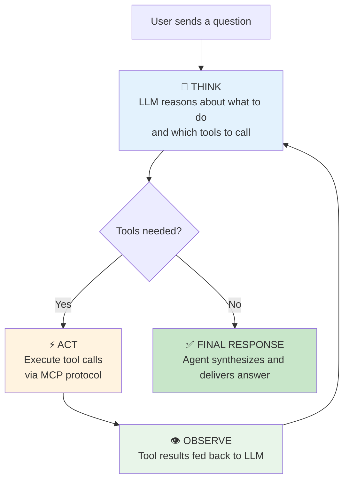
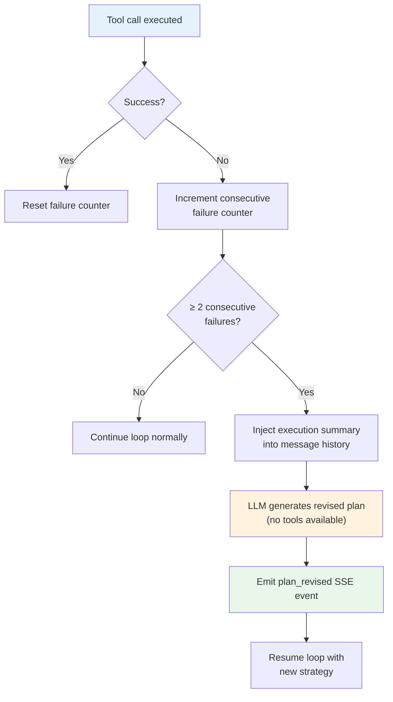
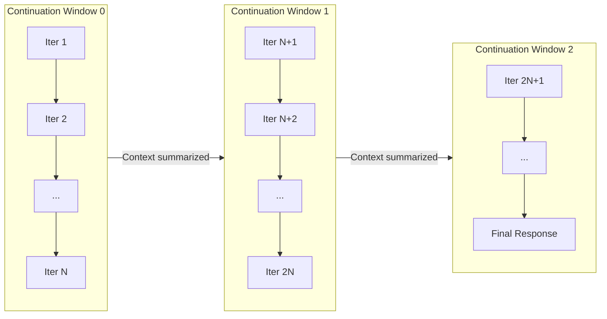
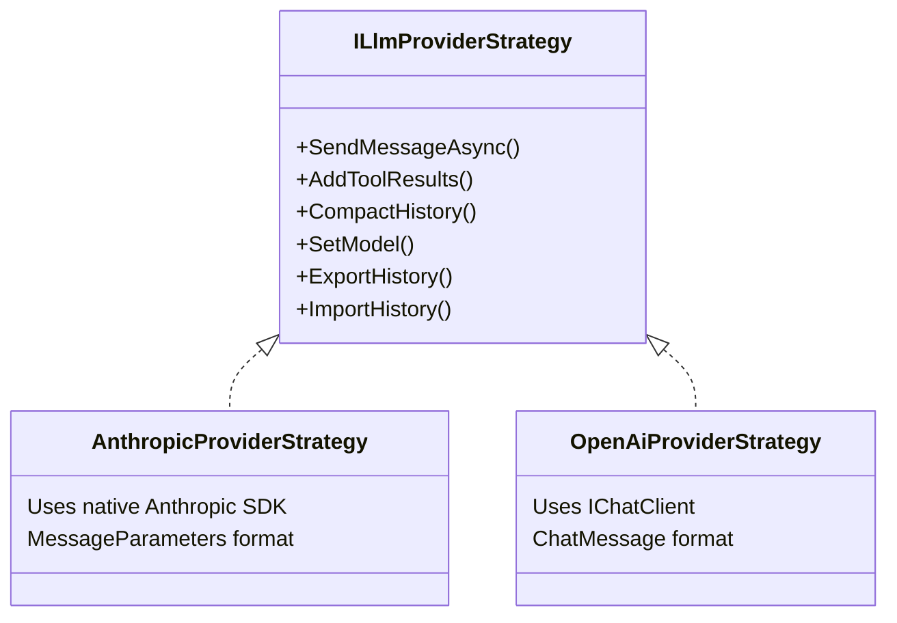

# Agent Execution Model — The ReAct Loop

At the heart of every Diva AI agent is the **ReAct loop** — a reasoning pattern where the agent iteratively **thinks** about what to do, **acts** by calling tools, and **observes** the results before deciding on the next step. This cycle continues until the agent has enough information to produce a final answer or reaches its iteration limit.

---

## The Think → Act → Observe Cycle

Every agent interaction follows the same fundamental pattern:

This is not a fixed script — the agent decides dynamically at each step whether to call more tools, revise its approach, or deliver a final answer. The LLM acts as both the reasoner and the controller of the loop.

---

## Walkthrough: A Real Execution

Let's trace through a concrete example to see how the ReAct loop works in practice.

**User query:** *"What was cart revenue for South Campus last month?"*

### Iteration 1 — Gather primary data

**Think:** The agent reasons that it needs cart revenue data for a specific location and time period.

**Act:** It calls the `GetMetricBreakdown` tool with parameters for cart rentals at South Campus for last month.

**Observe:** The tool returns structured data — total revenue of $24,500 across 1,250 transactions, averaging $19.60 per round.

### Iteration 2 — Add context

**Think:** The agent has the raw numbers but decides year-over-year context would make the answer more useful.

**Act:** It calls the `GetYoY` tool to compare against the same period last year.

**Observe:** The tool returns that the previous year's figure was $22,700, a 7.9% increase.

### Iteration 3 — Synthesize

**Think:** The agent now has all the data it needs. No more tools are required.

**Act:** No tool call — the agent generates its final response.

**Final Answer:** *"Cart rental revenue for South Campus last month was $24,500 across 1,250 transactions (avg $19.60/round). This is 7.9% higher than the same period last year."*

Every number in that answer is **grounded** in tool evidence — a crucial property that the [verification system](../quality/verification.md) checks.

---

## Plan Detection

When an agent receives a complex query that requires multiple steps, the LLM often begins by laying out a plan. Diva detects this automatically: if the first iteration's text output contains two or more numbered lines (e.g., "1. Get revenue data", "2. Compare year-over-year"), it is classified as a **plan** rather than ordinary thinking.

This plan is:

- Emitted as a `plan` SSE event so the UI can render it as a checklist
- Used by the adaptive re-planning system as a baseline to compare against

The detection uses a simple heuristic — numbered lines matching the pattern `N. description` — that works reliably across LLM providers without requiring structured output formats.

---

## Adaptive Re-Planning

Not every tool call succeeds. Network errors, invalid parameters, and timeout failures are all part of real-world agent execution. Diva handles this through **adaptive re-planning**.

The system tracks an **execution log** and a **consecutive failure counter**. After two or more consecutive tool failures:

1. A summary of what has been tried and what failed is injected into the conversation history
2. The LLM is called with **no tools available**, forcing it to reason about a new approach rather than retry the same failing strategy
3. The revised plan is emitted as a `plan_revised` event and the loop continues with the new strategy

This prevents the common failure mode where an agent gets stuck retrying the same broken tool call in a loop.

---

## Continuation Windows

LLMs have finite context windows — they can only process a limited amount of text in a single conversation. For complex tasks that require many iterations, a single context window may not be enough.

Diva solves this with **continuation windows** — an outer loop that wraps the main ReAct loop:

When the inner ReAct loop completes a window without producing a final answer:

1. The conversation history is **summarized** to compress older context
2. Tool state and evidence are preserved across the boundary
3. A `continuation_start` SSE event is emitted to notify the UI
4. A new window begins with the summarized context and a fresh iteration budget

**Iteration numbering is globally unique** — iterations never restart at 1 when a new window begins. This ensures the streaming UI can always map events to the correct iteration without ambiguity.

The maximum number of continuation windows is configurable both globally (via `AgentOptions.MaxContinuations`) and per-agent (via the agent definition).

---

## Provider Strategy Pattern

The ReAct loop logic is provider-agnostic. All LLM-specific details are encapsulated behind an `ILlmProviderStrategy` interface:

The unified loop calls `strategy.SendMessageAsync()` to get LLM responses and `strategy.AddToolResults()` to feed back tool outputs. Each strategy handles message formatting, token counting, and API specifics internally.

This design means:

- Adding a new LLM provider requires only a new strategy implementation — no changes to the ReAct loop itself
- Agents can switch between providers mid-execution (for example, a cheaper model for tool iterations and a premium model for the final answer) using `ExportHistory` and `ImportHistory` to transfer conversation state

---

## Per-Iteration Model Switching

Diva supports changing the LLM model (and even provider) between iterations of the ReAct loop. This is a powerful cost-optimization and quality-tuning feature.

Three layers of model-switching rules apply in priority order:

| Priority | Source | Description |
|----------|--------|-------------|
| 1 (highest) | Rule Pack rules | Admin-configured `model_switch` rules in Rule Packs |
| 2 | Static agent config | Per-agent `ModelSwitchingOptions` (tool iterations vs. final response vs. re-planning) |
| 3 (lowest) | Smart auto-router | Heuristic-based routing using agent variables |

A common configuration: use a fast, cheap model (like Claude Haiku or GPT-4o-mini) for tool-calling iterations where the LLM is mainly selecting which tool to call, then switch to a powerful model (like Claude Opus or GPT-4) for the final synthesis where response quality matters most.

When a model switch involves a different provider, the conversation history is exported to a provider-agnostic format and imported into the new strategy, preserving full context continuity.

---

## Error Handling & Robustness

The ReAct loop includes multiple layers of error handling:

- **Per-tool timeout:** Every MCP tool call is wrapped with a configurable timeout (`ToolTimeoutSeconds`, default 30 s). Sub-agent delegation calls use a separate, longer timeout (`SubAgentTimeoutSeconds`, default 300 s) because sub-agents run their own full ReAct loop. See [Agents-as-Tools Delegation](agent-delegation.md) for details.
- **Per-iteration LLM timeouts:** Streaming LLM calls use an idle timeout (`LlmStreamIdleTimeoutSeconds`, default 120 s) that resets on each received chunk. Buffered LLM calls use an absolute timeout (`LlmTimeoutSeconds`, default 120 s). Both are tighter than the outer `HttpTimeoutSeconds` (600 s) HttpClient timeout.
- **Mid-stream retry:** If streaming starts successfully but fails mid-transfer (connection drop, idle timeout), partial text is discarded and the call falls back to a buffered `CallLlmAsync` with 3 retries and exponential backoff.
- **LLM retry with backoff:** If the LLM provider returns a transient error, the call is retried with exponential backoff.
- **Tool error detection:** JSON parsing errors and error flags in tool results are detected, and the `hadToolErrors` flag prevents the agent from treating failed results as valid data.
- **Max-tokens handling:** When the LLM hits its token limit, the runner sets a `WasTruncated` flag on the hook context (visible to `OnBeforeIteration` hooks, e.g. to inject "be concise" instructions) and injects a single nudge prompt asking the model to continue more concisely. The nudge is attempted **once per continuation window**. If the LLM hits the limit again or the `OnError` hook returns `Abort`, the partial text is accepted as the final response rather than looping indefinitely.
- **Post-tool nudge:** After a tool-calling iteration, the model occasionally produces a narrative response ("Now I will send the email…") instead of actually calling the tool. In this case, the loop injects a corrective prompt — "You described an action but did not call the tool. If you still need to call a tool, call it now" — and continues once. This prevents the model from completing without performing the intended action.
- **Lifecycle hooks:** Custom error recovery logic can be injected via `OnError` hooks (see [Lifecycle Hooks](../core/lifecycle-hooks.md)).

---

## Key Properties of the ReAct Loop

| Property | Detail |
|----------|--------|
| Max iterations per window | Configurable globally and per-agent (default: 10) |
| Max continuation windows | Configurable globally and per-agent |
| Tool timeout | Configurable per tool type (default: 30 s for MCP, 300 s for sub-agents) |
| LLM streaming idle timeout | 120 s (resets per chunk) |
| LLM buffered timeout | 120 s (absolute) |
| Plan detection | 2+ numbered lines in first-iteration output |
| Re-plan trigger | 2+ consecutive tool failures |
| Model switching | Per-iteration, rule-driven or heuristic |
| Max output tokens | Configurable globally (default 8192) and overridable per-agent |
| Evidence accumulation | All tool results collected for verification |
| Streaming | Every step emitted as an SSE event in real time |
| Agent delegation | Peer agents callable as tools — see [Agents-as-Tools](agent-delegation.md) |
