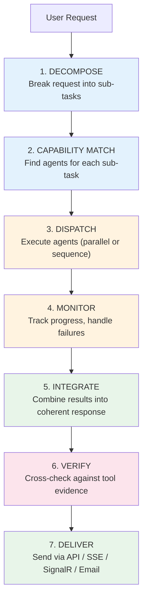
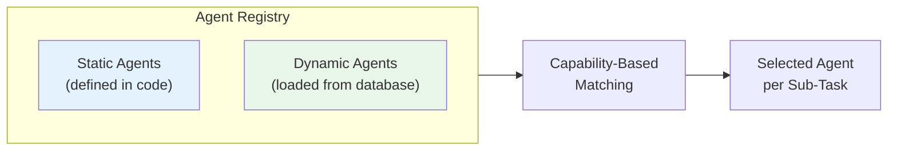
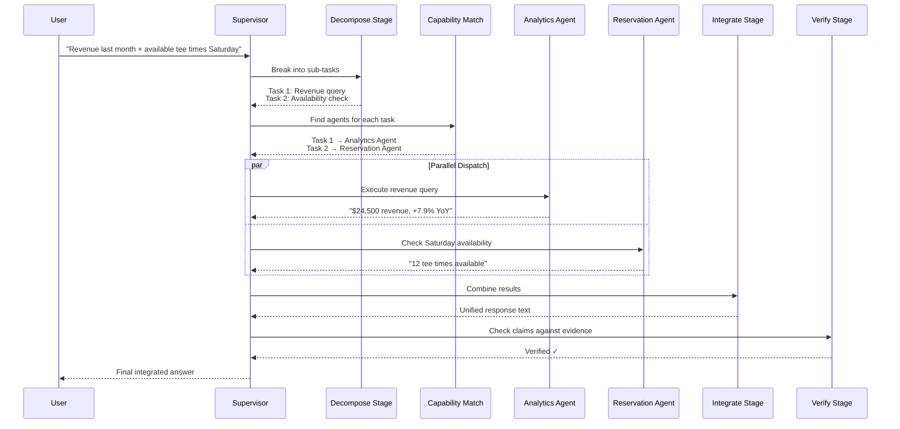

# Supervisor Pipeline — Multi-Agent Orchestration

Not every question can be answered by a single agent. When a user asks something that spans multiple domains — "What was last month's revenue breakdown and are there any available reservations for next week?" — the **Supervisor Pipeline** takes over. It decomposes the request, routes sub-tasks to specialist agents, and integrates their results into a single coherent response.

---

## The 7-Stage Pipeline

The supervisor processes every multi-agent request through seven sequential stages:

Each stage implements a common pipeline interface, and the supervisor executes them in order, passing state from one stage to the next.

---

## Stage 1: Decompose

The Decompose stage uses the LLM to break a complex request into discrete sub-tasks. Each sub-task includes:

- A natural-language description of what needs to be done
- The capabilities required (e.g., "analytics", "reservation", "weather")
- The site and tenant context inherited from the original request

For example, the question *"What was revenue last month and are there any tee times available Saturday?"* becomes two sub-tasks:

1. **"Get revenue breakdown for last month"** — requires `analytics` capability
2. **"Check tee time availability for Saturday"** — requires `reservation` capability

The decomposition is not hard-coded. The LLM reasons about the request structure and produces sub-tasks dynamically, which means the supervisor naturally handles novel request patterns it hasn't seen before.

---

## Stage 2: Capability Match

Once sub-tasks are defined, they need to be routed to agents that can handle them. The Capability Match stage consults the **Dynamic Agent Registry** to find the best agent for each sub-task.

### The Dynamic Agent Registry

The registry maintains a catalog of all available agents, loaded from two sources:

- **Static agents** are compiled into the application — they're always available
- **Dynamic agents** are defined at runtime through the admin portal and stored in the database. They can be added, modified, or removed without restarting the platform

Each agent declares capabilities — keywords that describe what it can do. The matcher compares sub-task requirements against agent capabilities and selects the best fit. When multiple agents match, priority values resolve the tie.

The registry is hot-reloadable: changes to agent definitions in the database take effect immediately without any platform restart.

---

## Stage 3: Dispatch

The Dispatch stage executes the selected agents. Depending on the nature of the sub-tasks, execution can be parallel or sequential:

- **Independent sub-tasks** (no data dependencies between them) run in parallel for maximum speed
- **Dependent sub-tasks** (where one needs the result of another) run in sequence

Each worker agent executes its own [ReAct loop](react-loop.md), calling tools and reasoning as needed. The Dispatch stage collects:

- The text response from each agent
- All tool evidence accumulated during execution (for later verification)
- Any errors or failures that occurred

---

## Stage 4: Monitor

The Monitor stage tracks the progress of dispatched agents and handles failures:

- If an agent fails or times out, the monitor can re-route the sub-task to a different agent with overlapping capabilities
- Progress events are forwarded to the SSE stream so the user sees real-time updates
- If all agents for a sub-task fail, the monitor records the failure for the Integration stage to handle gracefully

---

## Stage 5: Integrate

The Integration stage takes all worker results and combines them into a single, coherent response. This is not simple concatenation — the LLM synthesizes the information, resolves any contradictions, and produces a natural-language answer that addresses the original request holistically.

For example, if one agent returned revenue data and another returned reservation availability, the integrated response weaves both into a unified answer: *"Last month's revenue was $24,500 (up 7.9% YoY). For this Saturday, there are 12 available tee times between 7:00 AM and 2:00 PM."*

---

## Stage 6: Verify

The Verify stage runs [response verification](../quality/verification.md) on the integrated result. It pulls together tool evidence from all worker agents and checks that the integrated response's factual claims are grounded in that evidence.

This is particularly important in the supervisor path because the integration step introduces another opportunity for hallucination — the LLM might misquote or embellish a worker's result during synthesis.

The Verify stage uses the global verification mode (it intentionally does not use per-agent overrides, since the integrated response spans multiple agents).

---

## Stage 7: Deliver

The final stage delivers the verified response through one or more channels:

| Channel | When Used |
|---------|-----------|
| API Response (JSON) | Synchronous user requests |
| SSE Stream | Real-time streaming to web clients |
| SignalR Hub | Dashboard push notifications |
| Email (SMTP/SendGrid) | Scheduled reports, snapshots |
| Slack/Teams | Webhook integrations |

---

## Example: End-to-End Supervisor Flow

---

## Trigger Sources

The supervisor isn't limited to user-initiated requests. It can be triggered from several sources:

| Source | Example | How |
|--------|---------|-----|
| User request | "What was revenue last month?" | REST API call |
| Scheduled task | Daily revenue snapshot at 8 AM | Timer-based trigger |
| Event-driven | New booking confirmed → notify manager | Event consumer |

All trigger sources converge on the same supervisor pipeline, ensuring consistent decomposition, routing, verification, and delivery regardless of how the request originated.

---

## Key Design Decisions

**Why a pipeline?** The sequential stage design makes the supervisor predictable and debuggable. Each stage has a single responsibility, and state flows clearly from one to the next. Stages can be individually tested, monitored, and replaced.

**Why not just a single LLM call?** A single LLM call with all tools available becomes unreliable as the number of tools grows. Tool selection accuracy degrades with large tool surfaces. The supervisor splits the problem so each worker agent sees only the tools relevant to its domain.

**Why parallel dispatch?** Enterprise queries often span independent domains (financials + operations + HR). Running these in parallel dramatically reduces end-to-end latency compared to sequential execution.
