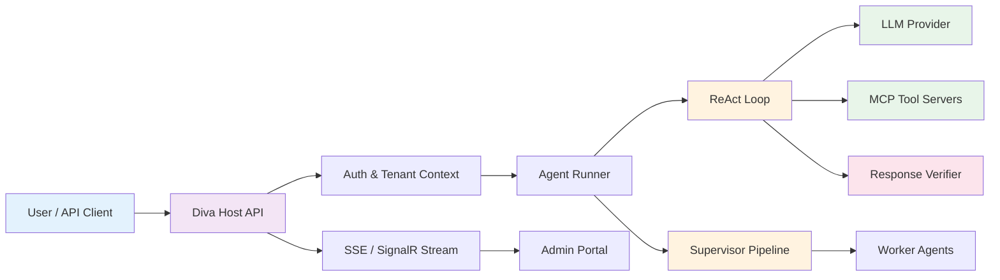

# Diva AI — Agent Architecture

Welcome to the architecture documentation for **Diva AI**, a multi-tenant enterprise AI agent platform. This site explains how Diva's agent system works — from the reasoning loop that powers every agent, to the multi-agent supervisor that orchestrates complex tasks, to the security and verification layers that keep everything safe.

---

## What is Diva AI?

Diva AI is an open-source platform that lets any SaaS application embed AI agent capabilities into their existing workflows. Built on **.NET 10** and **Semantic Kernel**, it provides:

- **Autonomous agents** that reason, use tools, and produce verified answers
- **Multi-tenant isolation** so every organization's data, agents, and rules stay separate
- **Dynamic configuration** — agents, tools, and business rules can all be changed at runtime through an admin portal
- **Enterprise-grade safety** with response verification, 5-layer security, and audit trails

---

## Architecture at a Glance

A request flows through authentication, into the agent runner which executes the ReAct reasoning loop, calls external tools via MCP, verifies the response, and streams results back in real time.

---

## Explore the Documentation

-   :material-brain:{ .lg .middle } **Agent Execution Model**

    ---

    How agents think, act, and observe using the ReAct loop — the core reasoning pattern behind every agent interaction.

    [:octicons-arrow-right-24: ReAct Loop](core/react-loop.md)

-   :material-sitemap:{ .lg .middle } **Supervisor Pipeline**

    ---

    How complex, multi-step tasks are decomposed and dispatched to specialist agents through a 7-stage orchestration pipeline.

    [:octicons-arrow-right-24: Supervisor Pipeline](core/supervisor-pipeline.md)

-   :material-puzzle:{ .lg .middle } **Agent Archetypes**

    ---

    Pre-built behavioral blueprints (RAG, Data Analyst, Researcher, and more) that let you spin up purpose-built agents instantly.

    [:octicons-arrow-right-24: Archetypes](core/archetypes.md)

-   :material-hook:{ .lg .middle } **Lifecycle Hooks**

    ---

    Composable interceptors that plug into 7 points of the agent lifecycle — from input validation to output formatting to error recovery.

    [:octicons-arrow-right-24: Lifecycle Hooks](core/lifecycle-hooks.md)

-   :material-wrench:{ .lg .middle } **MCP Tool Integration**

    ---

    How agents connect to external tool servers using the Model Context Protocol, with multi-server routing and credential management.

    [:octicons-arrow-right-24: MCP Tools](tools/mcp-integration.md)

-   :material-shield-check:{ .lg .middle } **Response Verification**

    ---

    Five verification modes that detect hallucinations and ungrounded claims before they reach the user.

    [:octicons-arrow-right-24: Verification](quality/verification.md)

-   :material-broadcast:{ .lg .middle } **SSE Events & Streaming**

    ---

    Real-time streaming of every reasoning step — from tool calls to plan revisions — via Server-Sent Events.

    [:octicons-arrow-right-24: SSE Streaming](streaming/sse-events.md)

-   :material-account-group:{ .lg .middle } **Tenant-Aware Agents**

    ---

    How multi-tenancy is baked into every layer — from JWT authentication to database isolation to prompt augmentation.

    [:octicons-arrow-right-24: Multi-Tenancy](tenancy/tenant-aware-agents.md)

---

## Technology Stack

| Layer | Technology |
|-------|-----------|
| Agent framework | Semantic Kernel 1.x |
| Tool protocol | Model Context Protocol (MCP) |
| LLM providers | Anthropic, OpenAI, Azure OpenAI, LM Studio, Ollama |
| Backend | .NET 10, ASP.NET Core 10, EF Core 10 |
| Database | SQLite (dev), SQL Server (enterprise) |
| Admin portal | React + TypeScript + Vite |
| Real-time | Server-Sent Events + SignalR |
| Observability | Serilog + OpenTelemetry + Prometheus |

---

## Who is this for?

This documentation is written for:

- **Developers** integrating Diva AI into their SaaS applications
- **Platform engineers** deploying and operating Diva AI
- **Internal team members** who need a polished reference for how the agent system works

For internal developer guidance (coding conventions, build commands, test patterns), see the `docs/` folder in the repository.
