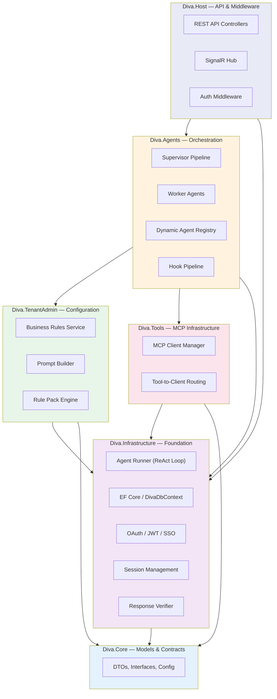
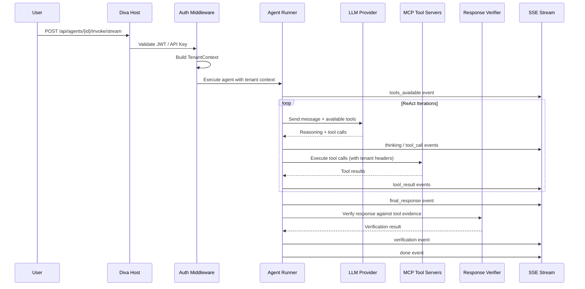

# Platform Overview

Diva AI is an open-source, multi-tenant enterprise AI agent platform. It enables any SaaS application to add AI agent capabilities — from answering natural-language business questions to executing multi-step workflows that span multiple data sources and external services.

---

## Design Philosophy

Diva is built around three core principles:

1. **Tenant isolation is non-negotiable.** Every agent interaction is scoped to a specific tenant and site. Data, business rules, prompts, and even LLM configurations are all tenant-aware. There is no scenario where one tenant's data leaks to another.

2. **Agents are dynamically configurable.** Agents are not compiled into the application — they are defined at runtime through a database-backed registry and configured via an admin portal. Adding a new agent, changing its tools, or modifying its behavior requires no code deployment.

3. **The platform is LLM-agnostic.** While Anthropic and OpenAI are first-class providers, any OpenAI-compatible endpoint works (LM Studio, Ollama, Azure OpenAI, LiteLLM proxy). Agents can even switch models mid-execution based on configurable rules.

---

## Solution Architecture

The platform is organized into six layers, each with clear responsibilities and strict dependency ordering:

### Layer Responsibilities

**Diva.Core** contains all models, DTOs, interfaces, and configuration classes. It has no external dependencies — every other project references it.

**Diva.Infrastructure** provides the foundational services: the agent runner that executes the ReAct loop, database access via EF Core, OAuth/JWT validation, session management, rule learning, and response verification.

**Diva.Tools** manages the MCP (Model Context Protocol) tool infrastructure — connecting to external tool servers, routing tool calls, and injecting tenant credentials.

**Diva.TenantAdmin** handles tenant-specific configuration: business rules that shape agent behavior, prompt augmentation that injects rules into system prompts, and rule packs that bundle configurable behaviors.

**Diva.Agents** is the orchestration layer. It contains the supervisor pipeline for multi-agent coordination, the dynamic agent registry for runtime agent discovery, worker agent wrappers, and the lifecycle hook pipeline.

**Diva.Host** is the ASP.NET Core entry point — REST API controllers, SignalR hub for real-time push, and all middleware wiring.

---

## How a Request Flows Through the Platform

When a user sends a natural-language query to Diva AI, here's what happens end-to-end:

1. The request arrives with a Bearer JWT or platform API key
2. Authentication middleware validates the token and builds a rich `TenantContext` (tenant ID, site IDs, user role, access permissions)
3. The agent runner loads the agent definition, connects to configured MCP tool servers, and enters the ReAct loop
4. Each iteration: the LLM reasons about what to do, optionally calls tools, and the results flow back
5. Every step is streamed to the client as an SSE event in real time
6. After the final response, the verifier cross-checks claims against tool evidence
7. The complete response (with verification metadata) is delivered

---

## LLM Provider Architecture

Diva supports multiple LLM providers through a strategy pattern. The agent runner delegates all LLM-specific logic to an `ILlmProviderStrategy` implementation:

| Provider | Strategy | Transport |
|----------|----------|-----------|
| Anthropic (Claude) | `AnthropicProviderStrategy` | Native Anthropic SDK |
| OpenAI / GPT | `OpenAiProviderStrategy` | OpenAI-compatible API |
| Azure OpenAI | `OpenAiProviderStrategy` | OpenAI-compatible API |
| LM Studio | `OpenAiProviderStrategy` | Local OpenAI-compatible API |
| Ollama | `OpenAiProviderStrategy` | Local OpenAI-compatible API |
| LiteLLM Proxy | `OpenAiProviderStrategy` | Proxy to any backend |

The ReAct loop logic is shared across all providers — only message formatting and API calls differ. Agents can even switch between providers mid-execution (for example, using a cheaper model for tool-calling iterations and a stronger model for the final synthesis).

---

## What Makes Diva Different

Unlike simple LLM wrappers or chatbot frameworks, Diva is designed for production enterprise workloads:

- **Multi-tenant by design** — not bolted on afterward. Tenant isolation is enforced at 5 independent layers (see [Tenant-Aware Agents](tenancy/tenant-aware-agents.md))
- **Verifiable outputs** — every response can be checked against the tool evidence that produced it (see [Response Verification](quality/verification.md))
- **Observable execution** — every reasoning step is streamed as a structured event, making agent behavior transparent and debuggable (see [SSE Events](streaming/sse-events.md))
- **Composable behavior** — lifecycle hooks and rule packs let administrators shape agent behavior without touching code (see [Lifecycle Hooks](core/lifecycle-hooks.md))
- **Agent-to-agent delegation** — agents can call other agents as tools, enabling peer-to-peer collaboration with full depth control and tenant context propagation (see [Agents-as-Tools Delegation](core/agent-delegation.md))
- **A2A protocol** — agents are discoverable via `/.well-known/agent.json` (public, no auth) and callable by external orchestrators via standardised task endpoints. All published agents are listable via `/.well-known/agents.json` (see [A2A Protocol](core/a2a-protocol.md))
- **Tool-first architecture** — agents interact with the world through the standardized MCP protocol, keeping integrations clean and reusable (see [MCP Tools](tools/mcp-integration.md))
