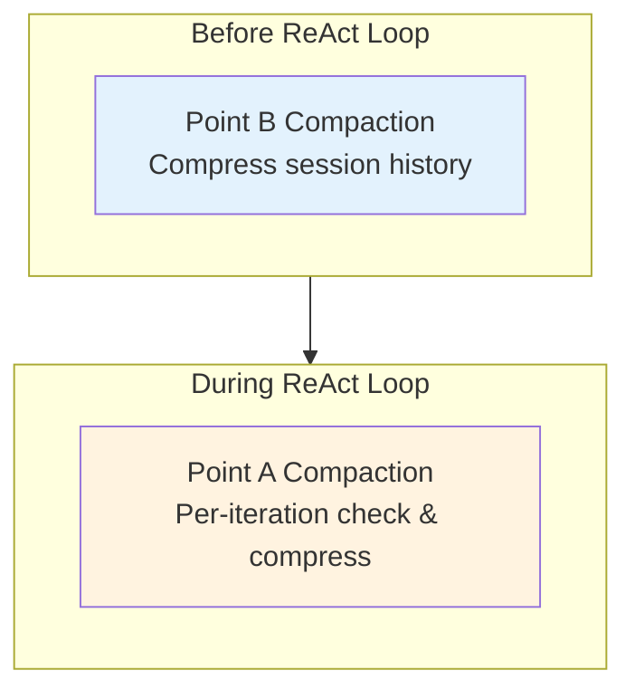
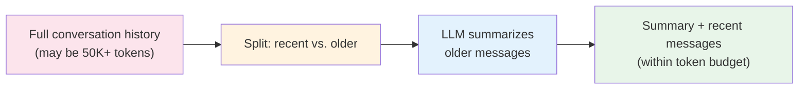
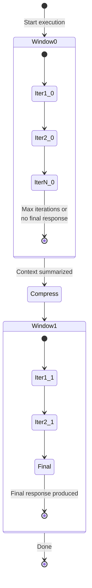

# Context Window Management

LLMs have a finite context window — the maximum amount of text they can process in a single conversation. A complex agent interaction that spans many iterations, tool calls, and responses can easily exceed this limit. Diva manages context windows intelligently through **compaction**, **summarization**, and **continuation windows** so that agents can handle arbitrarily long tasks without losing critical information.

---

## The Challenge

Each ReAct iteration adds to the conversation history: the agent's reasoning, tool calls, tool results, and any intermediate responses. A 10-iteration interaction with detailed tool results can easily consume 20,000+ tokens of context. Meanwhile, the LLM's context window has a hard limit (typically 100K–200K tokens for modern models, but effective reasoning degrades well before that).

Without management, two things happen:

1. **Context overflow** — The conversation exceeds the model's limit, causing an API error
2. **Attention degradation** — Even within limits, LLMs perform worse when irrelevant old context dilutes the signal

Diva addresses both through a two-point compaction system and an outer continuation loop.

---

## Two-Point Compaction

Context is compacted at two strategic points during execution:

### Point B — Pre-Loop History Compaction

Before the ReAct loop begins, Point B compacts the **session history** — the accumulated conversation from previous interactions in the same session. This is crucial for long-running sessions where a user asks multiple questions in sequence.

Long session histories are compressed using LLM-based summarization: older messages are replaced with a concise summary that preserves key facts and decisions while discarding redundant detail. The most recent messages are kept verbatim to preserve immediate conversational context.

Point B runs **once** per agent invocation, before the ReAct strategy is created.

### Point A — Per-Iteration Compaction

Inside the ReAct loop, Point A checks the conversation length at the start of each iteration. If the accumulated history (including all tool results from previous iterations) approaches the context threshold, it triggers compaction:

- Older tool results are summarized
- Redundant reasoning steps are condensed
- The conversation is compressed while preserving the current plan and recent evidence

Point A also runs at two critical moments:

- **Before re-planning** — When adaptive re-planning triggers (after consecutive tool failures), the context is compacted before the re-plan LLM call to ensure the LLM has maximum space for strategic reasoning
- **At continuation boundaries** — When starting a new continuation window, the conversation is compressed to give the new window a fresh token budget

---

## LLM-Based Summarization

The compaction engine uses the LLM itself to summarize older context. This is more sophisticated than simple truncation:

The summarization preserves:

- **Key facts and numbers** — Revenue figures, dates, names mentioned in tool results
- **Decisions made** — What the agent decided and why
- **Current plan** — The agent's active plan and progress
- **Tool evidence** — Critical data points needed for verification

It discards:

- **Intermediate reasoning** — Step-by-step thinking that led to decisions already made
- **Raw tool result formatting** — JSON structures and verbose tool output
- **Repeated acknowledgments** — "I see the data shows…" type responses

This means the summarized context is both smaller and more information-dense than the original, actually improving the LLM's ability to reason about the task.

---

## Continuation Windows

For tasks that require more iterations than a single context window allows, Diva uses **continuation windows** — an outer loop that wraps the main ReAct loop:

When the inner loop exhausts its iteration budget without producing a final answer:

1. The current context is **summarized** using the Point A compaction engine
2. Tool connections and evidence trails are **preserved** across the boundary
3. A `continuation_start` SSE event is emitted to notify the streaming client
4. A **new window** begins with summarized context and a fresh iteration budget

### What's Preserved vs. Reset

| State | Across Windows |
|-------|---------------|
| MCP tool connections | Preserved |
| Tool evidence trail | Preserved (accumulates) |
| Tool usage history | Preserved |
| Final response text | Preserved (updated) |
| Execution log | Reset |
| Consecutive failure counter | Reset |
| `hadToolErrors` flag | Reset |
| Plan emitted flag | Reset |
| Max-tokens nudge retries | Reset to 1 |

The principle: **infrastructure and evidence persist** while **failure tracking resets** to give each window a clean slate for error handling and re-planning.

### Globally Unique Iteration Numbering

Iteration numbers **never restart** when a new window begins. If Window 0 used iterations 1–10, Window 1 starts at iteration 11. This global uniqueness is critical for the streaming UI, which uses iteration numbers to match SSE events to the correct iteration display slot.

---

## Per-Agent Configuration

Context window management is configurable both globally and per-agent:

| Setting | Scope | Purpose |
|---------|-------|---------|
| Max iterations | Global + per-agent | How many iterations per window (default: 10) |
| Max continuations | Global + per-agent | How many continuation windows (default: varies by global config) |
| Context compaction threshold | Global | Token count that triggers Point A compaction |
| Max output tokens | Global + per-agent | Token limit for LLM output per call |

Per-agent settings override global defaults. This allows a simple chatbot to run with a single window and minimal iterations, while a complex research agent gets multiple windows with generous iteration budgets.

---

## Example: Context Flow

Here's how context evolves through a multi-window interaction:

**Window 0 (Iterations 1–10):**

- Iterations 1–3: Agent gathers revenue data from three locations
- Iteration 4: Agent compares numbers and identifies anomalies
- Iterations 5–8: Agent investigates anomalies by querying additional data sources
- Iterations 9–10: Agent reaches iteration limit without final synthesis

**Context summarization:**

> Previous analysis gathered revenue data for North ($24.5K), South ($31.2K), and Central ($18.9K) campuses. An anomaly was detected at Central (28% below target). Further investigation revealed a 3-week maintenance closure as the cause. Outstanding: need to quantify the financial impact and recommend recovery actions.

**Window 1 (Iterations 11–20):**

- Iteration 11: Agent calls tools to get expected revenue for the closure period
- Iteration 12: Agent calculates the gap
- Iteration 13: Agent synthesizes a final report with all findings and recommendations

The agent produced a comprehensive 13-iteration analysis that would have been impossible in a single context window, but the final answer is grounded in evidence from all iterations.

---

## Key Design Decisions

**Why LLM summarization instead of truncation?** Simple truncation throws away old information indiscriminately. LLM summarization preserves key facts, numbers, and decisions while discarding verbose formatting and redundant reasoning. The result is more information-dense context that the LLM can reason over more effectively.

**Why two compaction points?** Point B handles cross-invocation history (multiple questions in a session), while Point A handles within-invocation growth (many iterations in a single task). Together they address both dimensions of context growth.

**Why reset failure tracking at window boundaries?** A tool that failed in Window 0 might succeed in Window 1 (transient errors, changed conditions). Carrying forward failure counts would make the agent overly pessimistic. Fresh tracking per window gives each window the best chance of success.
