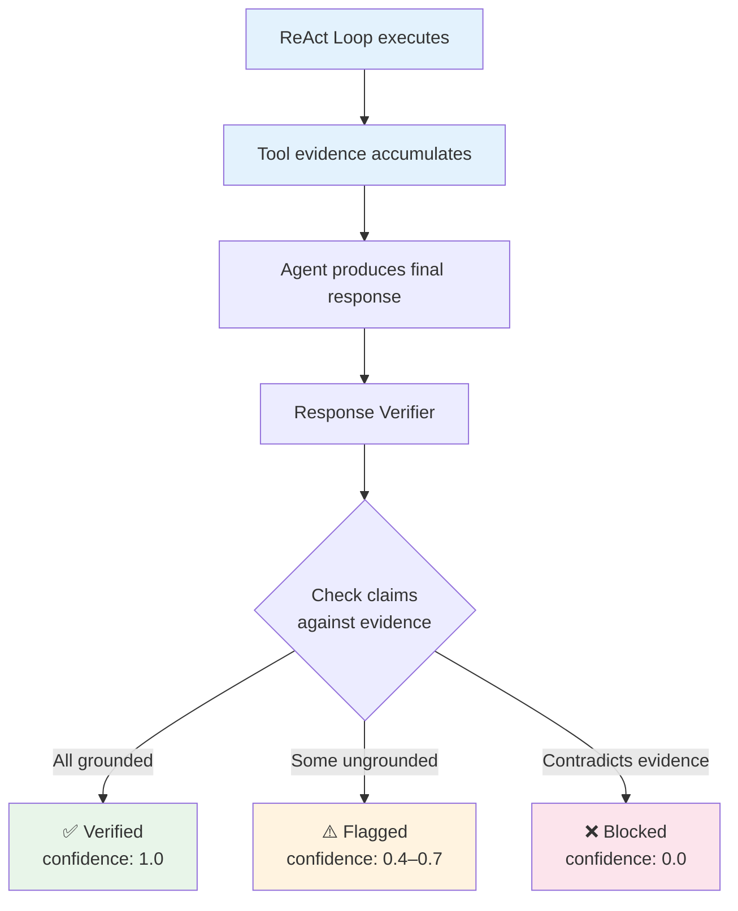
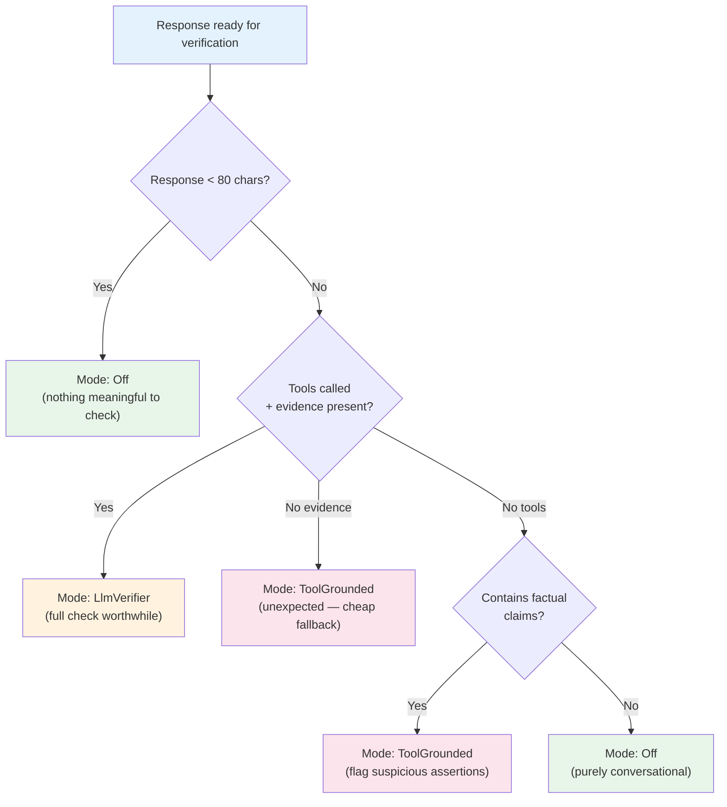
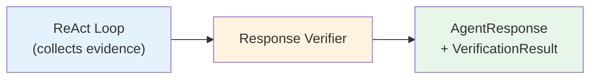
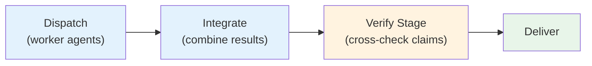

# Response Verification

LLMs can fabricate plausible-sounding facts when they have no grounded data. In an enterprise context, this is dangerous — an agent might report a revenue figure that sounds reasonable but was never returned by any tool. Diva's **response verification** system detects these hallucinations before they reach the user.

---

## The Problem

Without verification, the agent's output flows directly to the caller with no checks:

> **User:** "What is today's Sensex?"
> **Unverified agent:** "The Sensex is at 62,150.45 points." *(fabricated — no tool was called)*

The number looks specific and authoritative, but it was generated from the LLM's training data, not from a real-time market data tool. In a business context, acting on fabricated data can lead to incorrect decisions.

---

## How Verification Works

During the ReAct loop, every tool call result is collected into an **evidence trail** — a running log of all data returned by real tool calls. After the agent produces its final response, the verifier **cross-checks the response against this evidence**.

### Claim Types

Every factual assertion in the response is classified as one of three types:

| Type | Definition | Risk Level |
|------|-----------|------------|
| **Grounded** | Directly present in tool result data | Low — fully supported by evidence |
| **Inferred** | Logical conclusion from grounded data (e.g., calculating a percentage from two numbers) | Low — acceptable reasoning |
| **Ungrounded** | Factual assertion (number, name, date, event) with no tool backing | High — hallucination risk |

### Confidence Score

The verifier produces a confidence score between 0.0 and 1.0:

| Score | Meaning |
|-------|---------|
| **1.0** | All factual claims are directly grounded in tool evidence |
| **0.7** | Some claims are inferred (acceptable reasoning from grounded data) |
| **0.4** | Factual claims present but no tools were called |
| **0.0** | Response contains facts that explicitly contradict tool evidence |

---

## Five Verification Modes

Verification intensity is configurable — from no checks at all to strict blocking of unverified content. The mode can be set globally (default for all agents) and overridden per-agent.

### Off

No verification. The response passes through unchecked. Use only for development or internal testing.

**LLM cost:** None
**Latency:** None

### ToolGrounded

A lightweight check: if the agent made factual claims but never called any tools, all claims are flagged as potentially ungrounded. This catches the most obvious hallucination case (an agent answering a data question from memory instead of querying a data source) with zero additional LLM cost.

**LLM cost:** None
**Latency:** Negligible

### LlmVerifier

A second LLM call is made with the agent's response and all tool evidence. The verifier LLM is asked to identify any factual claims not supported by the evidence. This is the most thorough check — it can catch subtle hallucinations like misquoted numbers or embellished statistics.

**LLM cost:** ~1 additional LLM call
**Latency:** ~500ms

### Strict

Same as LlmVerifier, but with enforcement. If the confidence score falls below a configurable threshold, the response is **blocked** — the content is replaced with a safe message indicating the response could not be verified. The original response and verification reasoning are preserved in metadata but not shown to the user.

**LLM cost:** ~1 additional LLM call
**Latency:** ~500ms + potential retry

### Auto (Recommended)

A runtime heuristic that picks the cheapest sufficient verification level based on the response characteristics:

Auto mode optimizes for cost — it only uses the LlmVerifier when there is both tool evidence and a substantive response to verify. For short responses, conversational text, or cases where no tools were called, it falls back to cheaper modes.

**This is the recommended default.** It balances safety and cost across diverse agent types without requiring per-agent configuration.

---

## Per-Agent Override

Each agent can override the global verification mode. This lets administrators tune verification intensity based on the agent's purpose and risk profile:

| Agent Type | Override | Effective Mode | Why |
|-----------|----------|---------------|-----|
| Chatbot (no tools) | *none* → global Auto | Off (conversational) | No factual claims to verify |
| Data agent (tools + evidence) | *none* → global Auto | LlmVerifier | Full check on tool-grounded data |
| Compliance agent | `Strict` | Strict | Must block unverified claims |
| Dev/test agent | `Off` | Off | Skip verification for speed |

---

## Verification in the Architecture

### Single Agent Path

In single-agent execution, verification runs immediately after the ReAct loop produces a final response:

### Supervisor Path

In the supervisor pipeline, verification is a dedicated stage (Stage 6: Verify) that runs between integration and delivery:

The supervisor's Verify stage collects tool evidence from **all workers** and checks the integrated response against the combined evidence. It intentionally uses only the global verification mode (not per-agent overrides) because the integrated response spans multiple agents.

---

## Correction Retry

When verification identifies ungrounded claims and the mode allows retries, the system can **re-run the ReAct loop** with a correction hint:

1. The verifier identifies specific ungrounded claims  
2. A correction prompt is injected: *"The following claims could not be verified: [claims]. Please re-examine your data sources."*
3. A `correction` SSE event is emitted to notify the streaming client
4. The agent re-enters the ReAct loop and attempts to ground the claims with additional tool calls
5. The verified response replaces the original

The maximum number of correction retries is configurable (default: 1) to prevent infinite correction loops.

---

## Verification Output

Every verified response includes a `VerificationResult` with:

| Field | Description |
|-------|-------------|
| **IsVerified** | Whether the response passed verification |
| **Confidence** | Score from 0.0 to 1.0 |
| **Mode** | Which verification mode was used |
| **UngroundedClaims** | List of specific claims that couldn't be verified |
| **WasBlocked** | Whether Strict mode blocked the original response |
| **Reasoning** | Verifier's explanation (LlmVerifier mode only) |

This metadata is included in both the API response and the `verification` SSE event, enabling the admin portal to render verification badges and detailed diagnostics.
