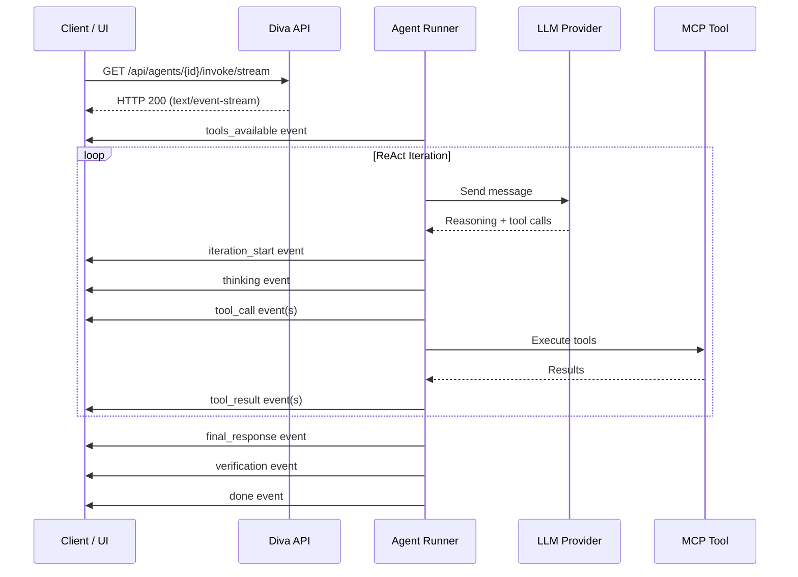
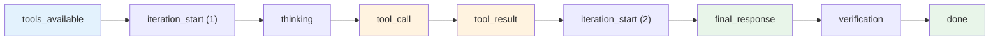

# SSE Events & Real-Time Streaming

Every step of an agent's reasoning is streamed to the client in real time via **Server-Sent Events (SSE)**. This makes agent execution transparent and observable — the user sees each thinking step, tool call, and result as it happens, rather than waiting for a final answer.

---

## How Streaming Works

When a client calls the agent's streaming endpoint, the server opens a long-lived HTTP connection and emits structured events as the agent executes:



Each event is a JSON object with a `type` field that identifies what happened and additional fields carrying the event payload.

---

## Event Types

Diva emits 15 distinct event types. Here is the complete reference in the order they typically appear:

### tools_available

**When:** Once, before the first iteration begins.

Announces the complete set of tools available to the agent. Enables the UI to show which tools the agent has access to before any reasoning begins.

| Field | Description |
|-------|-------------|
| `toolCount` | Total number of available tools |
| `toolNames` | List of tool names |

---

### plan

**When:** First iteration, if the LLM produces a numbered plan (2+ numbered lines detected).

The agent's initial plan for solving the task. Emitted instead of `thinking` when the first iteration's output matches the plan pattern.

| Field | Description |
|-------|-------------|
| `planText` | Full plan text |
| `planSteps` | Array of individual step descriptions |

---

### plan_revised

**When:** After 2+ consecutive tool failures trigger adaptive re-planning.

A revised plan generated after failures. The LLM was called with no tools available and asked to strategize a new approach.

| Field | Description |
|-------|-------------|
| `planText` | Revised plan text |
| `planSteps` | Array of revised step descriptions |

---

### iteration_start

**When:** At the start of each inner ReAct iteration.

Marks the beginning of a new reasoning cycle. The iteration number is globally unique across continuation windows.

| Field | Description |
|-------|-------------|
| `iteration` | Globally unique iteration number |

---

### model_switch

**When:** The LLM model changes between iterations.

Emitted when per-iteration model switching changes the active model or provider.

| Field | Description |
|-------|-------------|
| `iteration` | Current iteration number |
| `fromModel` | Previous model identifier |
| `toModel` | New model identifier |
| `fromProvider` | Previous provider (e.g., "Anthropic") |
| `toProvider` | New provider |
| `reason` | Why the switch happened (e.g., "rule_pack", "smart_router") |

---

### thinking

**When:** During any iteration where the LLM produces text output (not classified as a plan).

The agent's reasoning text — what it's considering, deciding, or explaining.

| Field | Description |
|-------|-------------|
| `iteration` | Current iteration number |
| `content` | Reasoning text |

---

### tool_call

**When:** Before a tool is executed.

Announces that the agent intends to call a specific tool with specific inputs. For parallel tool calls, multiple `tool_call` events are emitted before any `tool_result` events.

| Field | Description |
|-------|-------------|
| `iteration` | Current iteration number |
| `toolName` | Name of the tool being called |
| `toolInput` | Input parameters (JSON string) |

---

### tool_result

**When:** After a tool execution completes.

The result returned by the tool. For parallel tool calls, `tool_result` events are emitted in the same order as the corresponding `tool_call` events after all parallel executions complete.

| Field | Description |
|-------|-------------|
| `iteration` | Current iteration number |
| `toolName` | Name of the tool that was called |
| `toolOutput` | Result text from the tool |

---

### continuation_start

**When:** A new continuation window begins (window > 0).

Signals that the agent exhausted its iteration budget and is starting a new window with summarized context.

| Field | Description |
|-------|-------------|
| `continuationWindow` | Window number (1-based) |

---

### correction

**When:** Response verification identifies issues and triggers a re-iteration.

The verifier found ungrounded claims and injected a correction prompt. The agent will re-enter the ReAct loop to ground those claims.

---

### final_response

**When:** The agent produces its accepted final answer.

The complete response text after all reasoning, tool calls, and any corrections are complete.

| Field | Description |
|-------|-------------|
| `content` | Full response text |
| `sessionId` | Session identifier |

---

### verification

**When:** After the response verifier runs.

The verification result with confidence score, mode used, and any ungrounded claims detected.

| Field | Description |
|-------|-------------|
| `verification` | Complete verification result object |

---

### rule_suggestion

**When:** After rule learning extracts potential new rules from the interaction.

Suggested follow-up questions or rule suggestions based on the completed interaction.

| Field | Description |
|-------|-------------|
| `followUpQuestions` | Array of suggested follow-up questions |

---

### error

**When:** An LLM call or stream error occurs.

| Field | Description |
|-------|-------------|
| `errorMessage` | Error description |

---

### done

**When:** Always the last event emitted.

Signals that the agent execution is complete. Contains timing information for the full interaction.

| Field | Description |
|-------|-------------|
| `executionTime` | Total execution time |
| `sessionId` | Session identifier |

---

## Typical Event Sequences

### Simple query (1 tool call)



### Complex query (plan + multiple tools + re-planning)

```mermaid
graph LR
    A["tools_available"] --> B["plan"]
    B --> C["iteration_start (1)"]
    C --> D["tool_call"]
    D --> E["tool_result"]
    E --> F["iteration_start (2)"]
    F --> G["tool_call"]
    G --> H["tool_result ❌"]
    H --> I["iteration_start (3)"]
    I --> J["tool_call"]
    J --> K["tool_result ❌"]
    K --> L["plan_revised"]
    L --> M["iteration_start (4)"]
    M --> N["tool_call"]
    N --> O["tool_result ✅"]
    O --> P["final_response"]
    P --> Q["verification"]
    Q --> R["done"]

    style B fill:#e3f2fd
    style L fill:#fce4ec
    style P fill:#e8f5e9
```



### Multi-window conversation

```
tools_available
plan
iteration_start (1) → thinking → tool_call → tool_result
iteration_start (2) → thinking → tool_call → tool_result
...
iteration_start (10) → thinking → tool_call → tool_result
continuation_start (window 1)
iteration_start (11) → thinking → tool_call → tool_result
iteration_start (12) → final_response
verification
done
```

---

## SignalR Alternative

In addition to SSE, Diva offers a **SignalR hub** for real-time push. This is useful for:

- Dashboard widgets that display live agent activity
- Admin monitoring panels
- Scenarios where SSE's unidirectional nature is insufficient

The SignalR hub emits the same event types as the SSE stream, making it a drop-in alternative for clients that support WebSocket connections.

---

## Event Ordering Guarantees

- `tools_available` is always the first event
- `done` is always the last event
- `iteration_start` always precedes any events for that iteration
- `tool_call` events for parallel calls all appear before their `tool_result` events
- `final_response` always precedes `verification`
- `continuation_start` always appears between window boundaries
- Iteration numbers are strictly increasing and globally unique

---

## Rendering Events in the UI

The admin portal renders SSE events as a live execution timeline:

- **Plans** are shown as checkable step lists
- **Thinking** text appears in collapsible panels per iteration
- **Tool calls** show the tool name and input, with expandable output panels
- **The final response** is rendered as formatted HTML (sanitized with DOMPurify)
- **Verification** appears as a badge (verified/flagged/blocked) with expandable details

A "Detailed" toggle expands the timeline to show full, untruncated content for every event — useful for debugging agent behavior.
