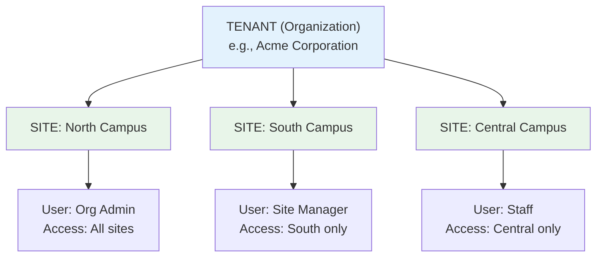
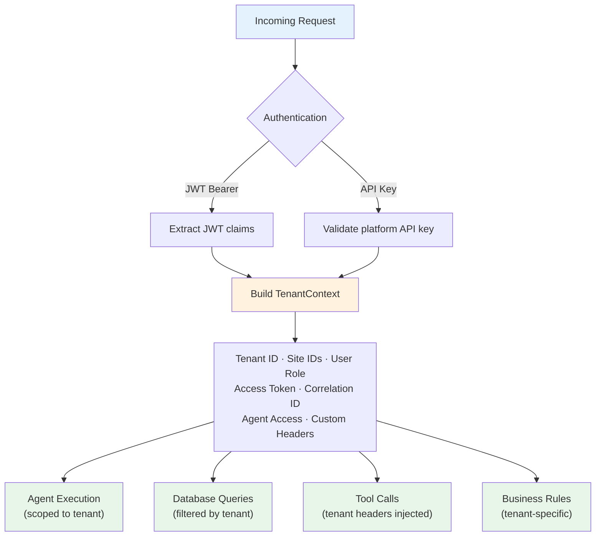
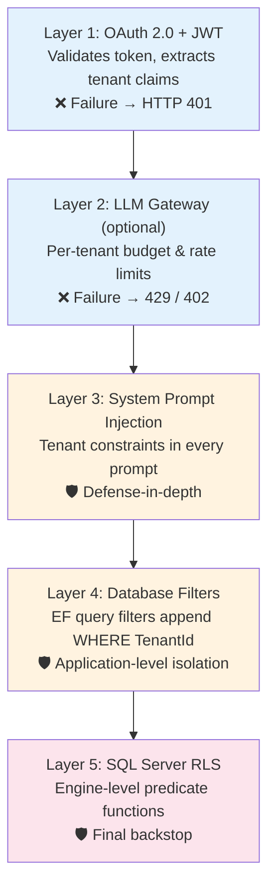
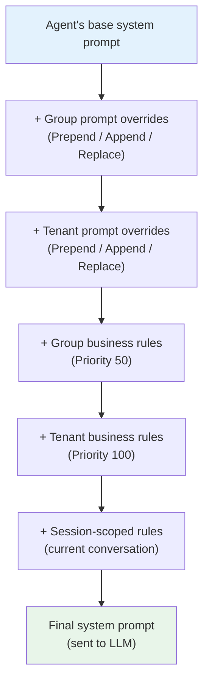

# Tenant-Aware Agents

Multi-tenancy is not a feature bolted onto Diva AI — it's woven into every layer of the architecture. From the moment a request arrives to the moment an agent calls a tool, tenant context flows through the entire system, ensuring that every organization's data, agents, rules, and configurations remain completely isolated.

---

## The Tenant Model

Diva uses a hierarchical multi-tenancy model:

- **Tenant** — An organization (company, department). All resources are scoped to a tenant.
- **Site** — A location or property within the organization. Tenants can have many sites.
- **User** — Authenticated individuals scoped to one or more sites within their tenant.

A user can only access data for the sites listed in their access permissions. An organization admin might see all sites, while a site manager sees only their assigned location.

---

## Tenant Context — The Flow

When a request arrives, authentication middleware extracts a rich **TenantContext** from the JWT token or platform API key. This context carries everything needed to scope the entire interaction:

The TenantContext includes:

| Field | Source | Purpose |
|-------|--------|---------|
| Tenant ID | JWT claim or API key | Scopes all data access |
| Site IDs | JWT claim or API key | Which sites this user can query |
| User Role | JWT claim or API key | Authorization level (admin, manager, staff) |
| Agent Access | JWT claim | Which agent types the user can invoke |
| Access Token | JWT Bearer | Propagated to MCP tool servers |
| Correlation ID | Generated | Distributed tracing across services |
| Custom Headers | Request / Config | Tenant-specific header mapping |

This context is **never constructed manually** in business logic — it always comes from the authentication middleware, ensuring consistency.

---

## Platform API Keys

In addition to SSO-issued JWTs, Diva supports **platform API keys** for service accounts, CI pipelines, and scheduled tasks that cannot participate in an interactive SSO login.

Platform API keys:

- Are prefixed with `diva_` for easy identification
- Are stored as a SHA-256 hash only — the raw key is displayed once at creation and never retrievable again
- Are validated via an `X-API-Key` request header, checked *before* the Bearer JWT in the auth pipeline
- Have a configurable **scope** (`FullAccess` or `AgentInvoke`) and optionally restrict access to specific agent IDs

| Scope | What it allows |
|-------|----------------|
| `FullAccess` | All API endpoints the equivalent user role could call |
| `AgentInvoke` | Agent invocation endpoints only; all admin/config paths are blocked |

Administrators manage platform API keys through the **Settings → API Keys** page in the admin portal. Keys can be rotated or revoked at any time.

---

## 5-Layer Security Pipeline

Tenant isolation is enforced through five independent security layers. Even if one layer fails, the others prevent cross-tenant data access:

**Layer 1 — OAuth 2.0 + JWT Validation:** Every request must carry a valid JWT. The middleware validates the signature, checks expiry, and extracts tenant claims. Invalid tokens result in immediate rejection (HTTP 401). No agent code is ever reached.

**Layer 2 — LLM Gateway (optional):** When the LiteLLM proxy is enabled, each tenant is mapped to a team with budget limits and rate limiting. This prevents a single tenant from consuming disproportionate LLM resources.

**Layer 3 — System Prompt Injection:** Every agent's system prompt includes security constraints that explicitly instruct the LLM to operate only within the current tenant and site scope, and to refuse cross-tenant requests. This is defense-in-depth — even if application logic fails, the LLM itself is told to enforce boundaries.

**Layer 4 — Database Query Filters:** EF Core query filters automatically append `WHERE TenantId = @currentTenantId` to every database query. This is transparent to application code — developers never write tenant filters manually, and cannot accidentally forget them.

**Layer 5 — SQL Server Row-Level Security:** For SQL Server deployments, row-level security policies at the database engine level provide the final backstop. Even if all application layers fail (bugs, misconfigurations, injection attacks), the database engine itself prevents cross-tenant data access.

### Public Endpoint Bypasses

A small number of paths bypass `TenantContextMiddleware` entirely — they are allowed through before any token validation occurs:

| Path prefix | Reason |
|-------------|--------|
| `/swagger` | Swagger UI and OpenAPI spec — developer tooling, no business data |
| `/hubs` | SignalR hub negotiation — authentication happens inside the hub after upgrade |
| `/.well-known` | A2A agent discovery (`agent.json`, `agents.json`) — must be publicly readable so external orchestrators can discover agents before they have a token |
| `/health` | Health check probes — no data returned |

These endpoints expose **no tenant data** by design. A2A discovery endpoints return only the agent's name, description, capabilities, and task URL — never business rules, prompts, sessions, or database content. Task execution (`POST /tasks/send`) is **not** bypassed and always requires a valid JWT or API key.

`AgentCardController` also carries `[AllowAnonymous]` as defence-in-depth against ASP.NET Core's own authentication middleware, which runs later in the pipeline.

---

## Tenant-Aware Prompt Augmentation

Each tenant can customize how agents behave through **business rules**, **prompt overrides**, and **session rules**. These are injected into the agent's system prompt at runtime by the Tenant-Aware Prompt Builder:

This means:

- **Tenant A** might define revenue as "SALES + SERVICES + RETAIL", use the term "client" instead of "customer", and have a 24-hour cancellation policy
- **Tenant B** might define revenue as "PRODUCTS + SERVICES + MAINTENANCE", use "guest" instead of "customer", and have a 48-hour cancellation policy

The same agent archetype serves both tenants, but the business logic embedded in their prompts is completely different.

### Per-Agent Business Rules

Business rules can be scoped to a **specific agent** rather than applying to all agents for a tenant. This lets administrators maintain, for example, a strict cancellation policy rule on a booking agent without affecting a general-purpose support agent.

When an agent executes:

1. The Tenant-Aware Prompt Builder first loads **global rules** (no agent scope) — these apply to every agent for the tenant
2. It then loads **agent-scoped rules** matching the agent's ID — these stack on top of the global rules

Administrators set the scope via the "Scope to specific agent" option in the Business Rules UI.

### Session-Scoped Rules

Beyond tenant-wide rules, agents can learn **session-scoped rules** during a conversation. If a user says "When I ask about revenue, always include the YoY comparison," the agent can recognize this as a rule and apply it for the remainder of the session.

These rules are stored per-session, not per-tenant, and expire when the session ends. The [rule learning system](#rule-learning) can promote useful session rules to tenant-wide rules for administrator approval.

---

## Dynamic Agent Registry

Agents themselves are tenant-scoped. The Dynamic Agent Registry loads agents from three sources:

| Source | Scope | Behavior |
|--------|-------|----------|
| Static agents | Platform-wide | Compiled into the application, always available |
| Dynamic agents | Per-tenant | Defined and managed by the tenant via admin portal |
| Group templates | Tenant group | Shared templates activated per-tenant via an overlay |

Dynamic agents are defined, configured, and managed per-tenant through the admin portal. One tenant might have a specialized "Revenue Analyst" agent, while another has a "Compliance Checker." Their agents are invisible to each other.

### Group-Level Agents

Platform administrators can publish **group agent templates** — canonical agent definitions shared across an entire tenant group. Tenants activate a template by creating an **overlay** that stores only the fields they want to customise. The registry merges the template with the overlay at runtime to produce the effective agent definition.

- Own agents always take precedence over group templates with the same ID
- A group template is invisible to a tenant until they explicitly activate it (create an overlay with `IsEnabled = true`)
- Template updates propagate automatically to all tenants whose overlay hasn't overridden the changed field

The registry is **hot-reloadable** — adding a new agent or changing an agent's configuration takes effect immediately without platform restart.

---

## Rule Learning

Diva agents can learn new business rules from interactions. There are three learning modes:

| Mode | Behavior |
|------|----------|
| **AutoApprove** | Learned rules apply immediately to the tenant |
| **RequireAdmin** | Learned rules are held as pending until an admin approves them |
| **SessionOnly** | Rules only apply within the current session |

The learning pipeline:

1. After an agent interaction, the **rule extractor** analyzes the conversation for patterns that could become rules
2. Extracted rules are classified and scored for relevance
3. Based on the learning mode, rules are either applied immediately, queued for admin review, or scoped to the session
4. Approved rules are injected into future prompts via the Tenant-Aware Prompt Builder

This creates a flywheel: the more tenants use their agents, the more refined the agents' behavior becomes for that specific tenant's domain.

---

## Database Isolation Strategies

Diva supports three database isolation strategies depending on the deployment mode:

| Strategy | Database | How It Works |
|----------|----------|-------------|
| Application-level filters | SQLite, SQL Server | EF Core `HasQueryFilter` automatically appends `WHERE TenantId` to every query |
| Row-Level Security (RLS) | SQL Server | Database engine enforces predicate functions on every data access |
| Database-per-tenant | SQL Server | Separate database per tenant, connection string switched per request |

For most deployments, application-level filters provide sufficient isolation. RLS adds a database-level backstop for high-security environments. Database-per-tenant provides the strongest isolation for enterprises that require physical data separation.

All entity models implement the `ITenantEntity` interface, which EF Core query filters use to enforce scoping. This is automatic and transparent — developers never need to remember to add tenant conditions to their queries.

---

## Tool Call Propagation

When an agent calls an MCP tool, the tenant context is propagated via HTTP headers:

| Header | Value |
|--------|-------|
| `Authorization` | Bearer token from user's SSO session or credential vault |
| `X-Tenant-ID` | Current tenant |
| `X-Site-ID` | Current site |
| `X-Correlation-ID` | Request correlation for tracing |
| Custom `X-Tenant-*` headers | Tenant-specific mappings |

This ensures that downstream tool servers always know which tenant and site the request belongs to. Tool servers can use these headers to scope their own data access, creating end-to-end tenant isolation from the user through the agent to the backend services.

For details on tool authentication and credential management, see [MCP Tool Integration](../tools/mcp-integration.md).
