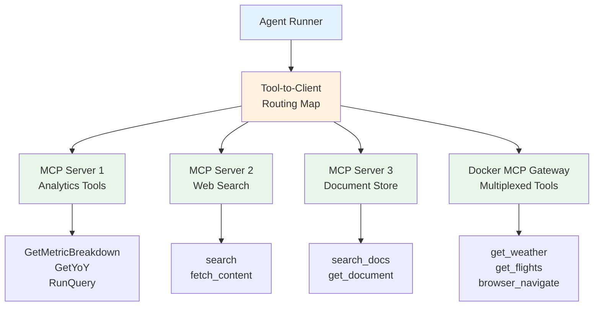
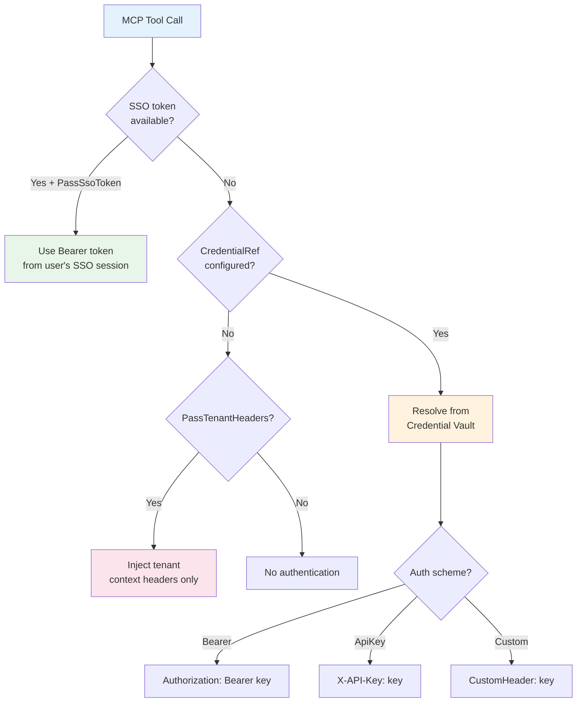
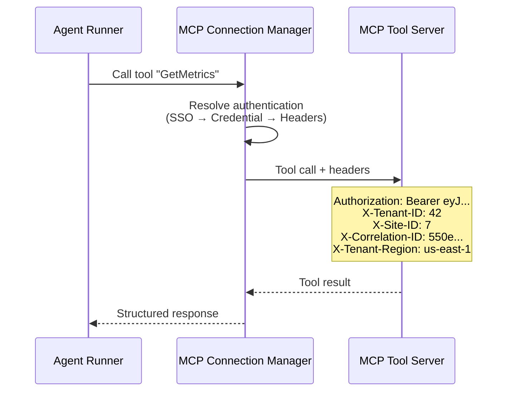

# MCP Tool Integration

Diva AI agents interact with the outside world through **MCP (Model Context Protocol)** — an open standard for connecting LLM applications to external tools and data sources. Rather than building tool integrations into the agent code itself, Diva connects to standalone MCP servers that expose tools as a service.

---

## What is MCP?

The Model Context Protocol defines a standard way for AI applications to discover and call tools provided by external servers. An MCP server exposes a set of tools (functions with defined inputs and outputs), and the client (Diva) can:

1. **Discover** what tools are available
2. **Call** any tool with structured parameters
3. **Receive** structured results

This separation keeps tool implementations independent of the agent platform. A weather MCP server, a database query server, and a web search server can each be developed, deployed, and scaled independently.

---

## Multi-Server Architecture

Each agent can connect to **multiple MCP servers simultaneously**. This is essential for agents that need tools from different domains — for example, an agent that queries a database, searches the web, and reads documents all in one interaction.

When an agent starts, the platform:

1. Reads the agent's configured **tool bindings** (a list of MCP server connections)
2. Connects to all valid bindings in parallel
3. Queries each server for its available tools
4. Builds a **tool-to-client routing map** — a lookup table that maps each tool name to the MCP server that owns it

When the LLM decides to call a tool, the runner looks up the tool name in the routing map and routes the call to the correct server. This routing is transparent to the LLM — it just sees a flat list of available tools.

---

## Transport Modes

MCP servers can be connected via two transport mechanisms:

### Stdio (Standard I/O)

The platform launches the MCP server as a child process and communicates via stdin/stdout. This is the default and simplest mode — it works with any MCP server that follows the protocol.

### HTTP / Server-Sent Events

For remote MCP servers, the platform connects via HTTP. The server exposes an SSE endpoint for real-time communication. This mode is used for:

- MCP servers running on different machines
- Shared MCP servers that serve multiple clients
- Cloud-hosted tool services

---

## Docker MCP Gateway

Docker Desktop (4.42+) includes an **MCP Gateway** that multiplexes multiple MCP tool servers through a single endpoint. Instead of configuring each tool server individually, you configure the gateway once and it provides access to all registered tools.

The gateway supports both transport modes:

| Mode | Connection | When to Use |
|------|-----------|-------------|
| Stdio (default) | Launch as child process | Local Docker Desktop with MCP Toolkit |
| HTTP/SSE | Connect to HTTP endpoint | Remote or headless environments |

Known tools available through the Docker MCP Gateway include weather services, web search (DuckDuckGo), flight search, browser automation (Playwright), and meta-tools for discovering additional MCP servers.

---

## Tool Binding Configuration

Each MCP server connection is defined as a **tool binding** on the agent. A binding specifies:

| Field | Purpose |
|-------|---------|
| **Name** | Human-readable identifier for the binding |
| **Command** | Executable to launch (stdio mode) |
| **Args** | Command-line arguments |
| **Endpoint** | URL for HTTP/SSE mode |
| **Transport** | `stdio` or `http` |
| **CredentialRef** | Reference to a stored credential for authentication |
| **PassSsoToken** | Whether to forward the user's SSO Bearer token |
| **PassTenantHeaders** | Whether to inject tenant context headers |
| **Access** | Tool access level: ReadOnly, ReadWrite, or Destructive |

Bindings are configured per-agent through the admin portal's Agent Builder interface.

---

## Credential Management

MCP tool servers often require authentication. Diva supports a **3-tier authentication model** for outbound tool calls, applied in priority order:

1. **SSO Bearer token** — If the binding has `PassSsoToken` enabled and the user authenticated via SSO, the user's actual Bearer token is forwarded to the tool server. This enables end-to-end identity propagation.

2. **Credential Vault** — If the binding references a stored credential (`CredentialRef`), the platform resolves it from the encrypted credential vault. The credential's auth scheme determines how it's injected (Bearer, API key, or custom header).

3. **Tenant headers only** — If no SSO token or credential is available, but `PassTenantHeaders` is enabled, only tenant context headers (Tenant ID, Site ID, Correlation ID) are sent.

### Credential Vault Security

Stored credentials are encrypted at rest using AES-256-GCM:

- Each credential is encrypted with a master key configured in the platform
- The encrypted format includes a random nonce, ciphertext, and authentication tag
- Credentials are decrypted only at the moment of use, with a short-lived in-memory cache
- Credential names are case-sensitive and tenant-scoped

---

## Header Injection

Every MCP tool call automatically receives tenant context headers, ensuring that downstream services always know which tenant and site the request belongs to:

Headers include:

- **Authorization** — Bearer token (from SSO or credential vault)
- **X-Tenant-ID** — The tenant making the request
- **X-Site-ID** — The specific site context
- **X-Correlation-ID** — Request correlation for distributed tracing
- **X-Tenant-*** — Any custom tenant-specific headers

Tenants can configure custom header mappings to adapt to their backend services' requirements. For example, a tenant might map their JWT claim `backend_tenant_id` to an `X-Backend-Tenant` header.

---

## Tool Discovery (MCP Probe)

Before saving a tool binding, administrators can **probe** the MCP server to discover what tools it provides. The probe endpoint connects to the server, queries its tool catalog, and returns the results — all without committing the binding to the agent.

This lets administrators verify that:

- The MCP server is reachable and responding
- The expected tools are available
- The tool names and descriptions match expectations

The probe has a 30-second timeout to prevent hanging on unresponsive servers.

---

## Key Design Decisions

**Why MCP instead of built-in tools?** MCP keeps tool implementations separate from the agent platform. Tools can be developed in any language, deployed independently, and shared across multiple agents. The platform doesn't need to know the internals of any tool — it only needs the MCP protocol.

**Why multi-server?** Real enterprise agents need tools from many domains. A single monolithic tool server would become unwieldy and create deployment coupling. Multi-server architecture lets each domain team own their tools independently.

**Why a routing map?** The LLM sees a flat list of tools (it doesn't know or care which server provides each one). The routing map handles the dispatch transparently, keeping the agent's reasoning simple while supporting complex multi-server topologies behind the scenes.
