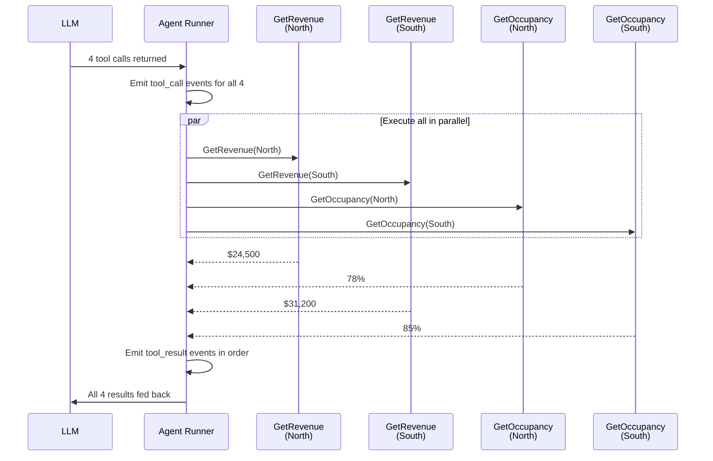
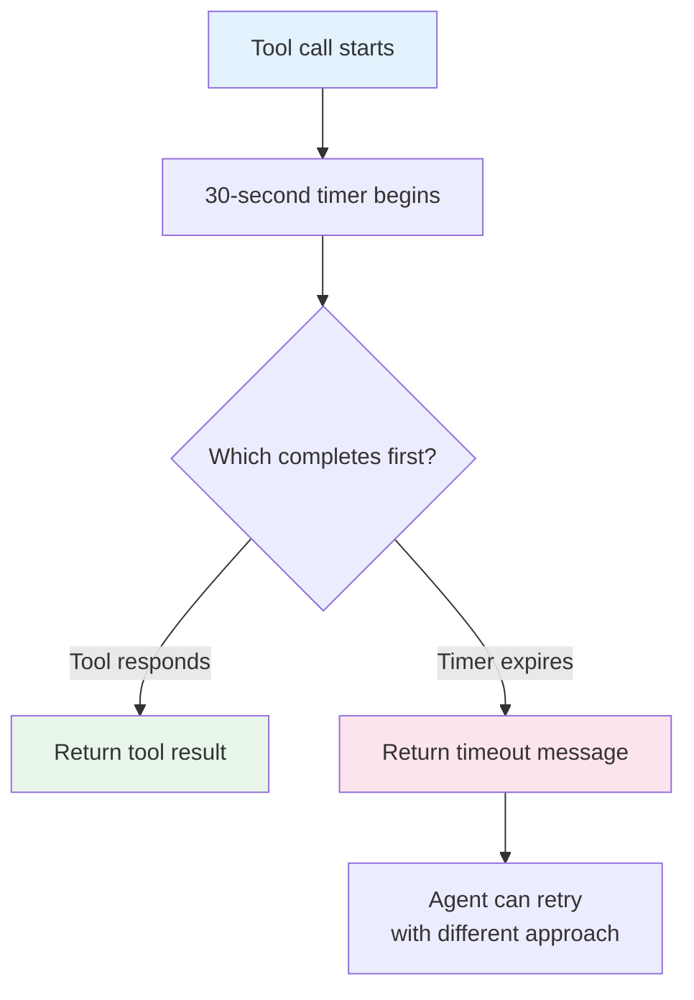
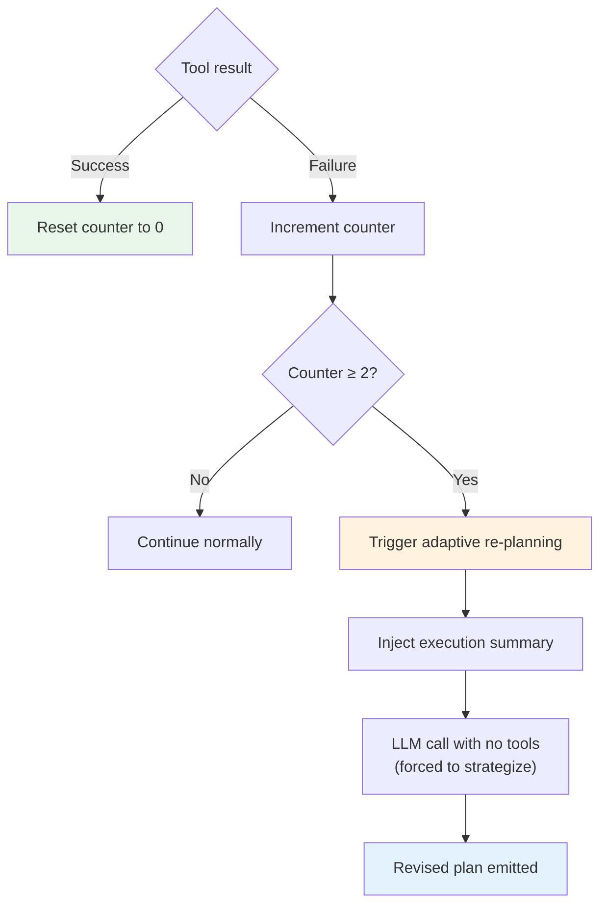

# Parallel Execution & Timeouts

When an LLM returns multiple tool calls in a single response, Diva executes them all in parallel rather than sequentially. Combined with per-tool timeouts and intelligent error handling, this design maximizes throughput while keeping the agent resilient to individual tool failures.

---

## Parallel Tool Execution

Modern LLMs can request multiple tool calls in a single response. For example, when asked *"Compare revenue and occupancy for North and South Campus"*, the LLM might return four tool calls in one shot — revenue and occupancy for each campus.

Diva handles this by executing all returned tool calls concurrently:

The execution flow:

1. **All `tool_call` SSE events are emitted first** — the streaming client sees all planned calls immediately
2. **All tools execute concurrently** — there is no waiting between them
3. **All `tool_result` SSE events are emitted** in the original order (matching the tool_call order) after all executions complete
4. **All results are fed back to the LLM** as a single batch

This is significantly faster than sequential execution, especially when tool calls are I/O-bound (network requests, database queries). Four tool calls that each take 2 seconds complete in ~2 seconds total instead of ~8 seconds.

---

## Tool Call Deduplication

Sometimes the LLM produces duplicate tool calls — identical tool name and parameters in the same response. This typically happens when the LLM is uncertain or when the prompt structure leads to repetitive reasoning.

Diva detects and deduplicates these calls before execution:

- Tool calls with the same name and identical input parameters are collapsed into a single execution
- The result is shared across all deduplicated calls
- Deduplication only applies within a single LLM response, not across iterations

This saves both latency and API quota on the downstream tool servers.

---

## Per-Tool Timeout

Every MCP tool call is wrapped with a configurable timeout (`ToolTimeoutSeconds`, default 30 seconds). If a tool doesn't respond within this window, execution is cancelled and the agent receives a timeout message:

> *"Tool 'search' timed out after 30s. Try a narrower query."*

!!! note "Sub-agent delegation uses a separate timeout"
    When an agent calls another agent via [agents-as-tools delegation](../core/agent-delegation.md), the timeout is `SubAgentTimeoutSeconds` (default 300 s) — not `ToolTimeoutSeconds`. Sub-agents run their own full ReAct loop with multiple LLM calls and tool executions, requiring significantly more time than a single MCP tool call.

The timeout message is designed to guide the agent toward a solution — suggesting a narrower query hints that the tool might succeed with more specific parameters.

Key behaviors:

- The timeout applies to **each tool independently** — if one tool times out during a parallel batch, the others still complete normally
- Timed-out tool calls count as failures for the consecutive failure counter (which can trigger [adaptive re-planning](../core/react-loop.md#adaptive-re-planning))
- The timeout is configurable via `AgentOptions.ToolTimeoutSeconds` in `appsettings.json`
- Sub-agent delegation tools use `SubAgentTimeoutSeconds` (300 s) instead — see [Agent Delegation](../core/agent-delegation.md)

---

## Error Detection & Retry

Tool calls can fail in several ways. Diva detects and handles each type:

### JSON Error Detection

When a tool returns a result, Diva checks for common error patterns in the output — JSON error objects, HTTP error status descriptions, or explicit error flags. When detected, the tool result is marked as an error, preventing the agent from treating error messages as valid data.

### The `hadToolErrors` Flag

When any tool in an iteration returns an error, the `hadToolErrors` flag is set. This flag serves two purposes:

1. **Acknowledgment loop prevention** — Without this flag, the LLM might simply acknowledge the error ("I see there was an error") without taking corrective action, creating an infinite acknowledge-and-retry loop
2. **Informed re-planning** — The agent knows that its previous approach failed and should try something different

### Consecutive Failure Tracking

The runner maintains a **consecutive failure counter** that increments each time a tool call fails and resets on any success. This counter drives adaptive re-planning:

After 2 or more consecutive failures:

1. An **execution summary** of all attempts and failures is injected into the conversation
2. The LLM is called with **tools disabled**, forcing it to reason about a new strategy instead of retrying the same approach
3. A `plan_revised` SSE event is emitted with the new strategy
4. The loop resumes with tools re-enabled and the new plan guiding the agent's behavior

---

## Execution Logging

Every tool call — successful or not — is recorded in an **execution log** that persists for the duration of the ReAct loop. The log captures:

- Tool name and input parameters
- Whether the call succeeded or failed
- The result (or error message)
- Execution time

This log serves multiple purposes:

- **Re-planning context** — When adaptive re-planning triggers, the execution log gives the LLM a complete picture of what has been tried
- **Debugging** — The log can be inspected in the SSE event stream to diagnose agent behavior
- **Evidence accumulation** — Successful tool results are added to the verification evidence trail

---

## State Across Continuation Windows

When the ReAct loop crosses a [continuation window](../quality/context-management.md) boundary, some tool-related state is preserved and some is reset:

| State | Across Windows |
|-------|---------------|
| Tool connections (MCP clients) | **Preserved** — no reconnection needed |
| Tool evidence trail | **Preserved** — accumulates across all windows |
| Execution log | **Reset** per window |
| Consecutive failure counter | **Reset** per window |
| `hadToolErrors` flag | **Reset** per window |

This design ensures that tool infrastructure stays connected while giving each window a fresh slate for failure tracking and re-planning.
